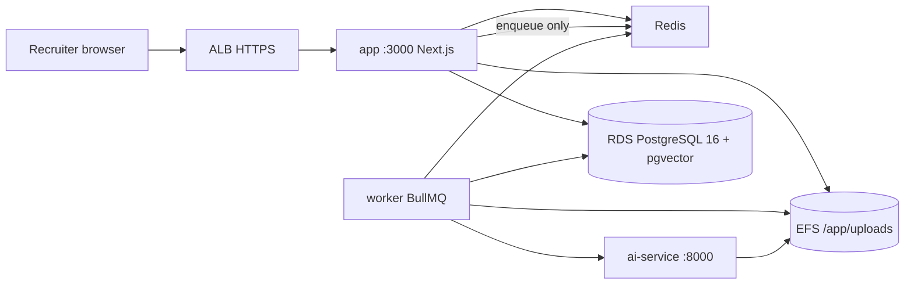
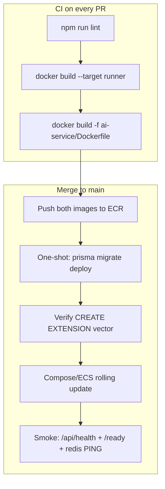

# Agile Turn ATS — AWS Deployment Pipeline and Performance Standard

**Audience:** engineering colleagues deploying or operating this application.  
**Scope:** production runtime, CI/CD, health gates, and the sizing required so the product is not laggy.  
**Status:** runbook. This repository does not yet contain GitHub Actions; Coolify (`docker-compose.yml`) and `scripts/azure-deploy.sh` are the existing ship paths. This document is the AWS production contract.

---

## 1. Executive summary

This is a **multi-process recruitment ATS**, not a static Next.js site. If any of Postgres, Redis, the Next.js server, the BullMQ worker, or the Python AI service is missing, recruiters will see a UI that looks “up” while search, resume parse, embeddings, email, and recommendations silently degrade.

**Production on AWS is the Coolify topology** (`docker-compose.yml`): five processes, shared resume disk, Postgres with `pgvector`. We do **not** use Vercel as the production host. We do **not** squeeze the full stack into the Azure all-in-one 2 CPU / 4 GiB box for production UX — that size is a student/demo envelope, not a latency budget.

| Goal | Decision |
|------|----------|
| Region | `ap-south-1` (Mumbai), matching `scripts/azure-deploy.sh` default `LOCATION=centralindia` |
| Compute | One ECS-optimized **Graviton `t4g.xlarge`** (4 vCPU / 16 GiB) running the compose services |
| Database | **Amazon RDS PostgreSQL 16**, `db.t4g.medium` (4 GiB), Single-AZ, `vector` extension |
| Files | **Amazon EFS** mounted at `/app/uploads` on `app`, `worker`, and `ai-service` |
| Edge | Application Load Balancer + ACM HTTPS → `app:3000` |
| Redis | Redis 7 in compose (`appendonly yes`), not ElastiCache, until replica count > 1 |
| Images | `Dockerfile` target `runner` for `app` and `worker`; `ai-service/Dockerfile` for AI (models baked at build) |

Approximate On-Demand us-east-1 list cost for this layout is on the order of **$120–150 / month** (RDS + EC2 + ALB + EFS). Mumbai is typically 10–20% higher. This is the performance-first size, not the cheapest size.

---

## 2. Definition of “fully running”

The product is fully running only when **all** of the following are true at the same time.

| Process | How it is started | Proof it is required | Healthy when |
|---------|-------------------|----------------------|--------------|
| PostgreSQL 16 + `pgvector` | RDS (not a container in AWS) | `docker-compose.yml` image `pgvector/pgvector:pg16`; `prisma/migrations/20260527000100_enable_pgvector_extension/migration.sql` (`CREATE EXTENSION IF NOT EXISTS vector`) | `pg_isready`; `SELECT extname FROM pg_extension WHERE extname = 'vector'` |
| Redis 7 | Compose `redis` | `package.json` `bullmq` + `ioredis`; `workers/index.ts` exits if Redis is unset | `redis-cli ping` → `PONG` |
| Next.js | Compose `app`, `CMD ["node", "server.js"]` | `next.config.mjs` `output: "standalone"`; `package.json` `"start": "next start"` | `GET /api/health` → `{ ok: true, database: "connected" }` (`app/api/health/route.js`) |
| BullMQ worker | Compose `worker` | `workers/index.ts`; `src/lib/queues/workers/index.ts` starts parse + embedding + email | Process alive (`ps` healthcheck in compose); queues `ats-resume-parsing`, `ats-embedding`, `ats-email` |
| AI service | Compose `ai-service` | `ai-service/Dockerfile`; `src/lib/ai/embedding-client.ts` `POST {AI_SERVICE_URL}/embed` | `GET /health` then `GET /ready` (`ai-service/app/routes/health.py`) |

**Shared disk (not optional):** `src/lib/resume-storage.ts` writes resume files with `node:fs`. Compose bind-mounts `./uploads` into `app` (rw), `worker` (rw), and `ai-service` (ro). On AWS that mount is **EFS** at `/app/uploads`. Ephemeral container disk will drop files on every deploy (called out in `README.md` “Deploy on Vercel”).

**Queues the worker actually consumes** (`src/lib/queues/queue-names.ts` + `src/lib/queues/workers/index.ts`):

- `ats-resume-parsing` — concurrency **2** (`src/lib/queues/workers/resume-parsing-worker.ts`)
- `ats-embedding` — concurrency **2**, rate-limited (`src/lib/queues/workers/embedding-worker.ts`)
- `ats-email` — concurrency default **3** (`EMAIL_WORKER_CONCURRENCY`, `src/lib/queues/queue-worker-rate-limit.ts`)

`ats-analytics` exists as a queue name. The worker process does **not** start an analytics consumer; dashboard charts are served from the Next.js process with Redis cache (`DASHBOARD_ANALYTICS_CACHE_TTL_SEC`, 5–15 minutes). Do not wait for a fourth worker.

If Redis is down, Next.js still boots. Caching and rate limits fall back to in-memory (`src/lib/cache` / `.env.example`). The **worker process exits**. Resume parse, embeddings, and transactional email stop. That is not an acceptable production state.

---

## 3. Why production must isolate HTTP from background work

Resume parse talks to the AI service with a **120 second** timeout (`DEFAULT_PARSE_TIMEOUT_MS` in `src/lib/ai-service-client.ts`). Embedding calls use **30 seconds** (`DEFAULT_EMBED_TIMEOUT_MS` in `src/lib/ai/embedding-client.ts`). Those jobs belong on the worker, not on the request thread.



**Lag rule:** a dashboard click, login, or search must not wait for spaCy, MiniLM, Gemini, or SMTP. The API enqueues (`BullMQ`) and returns. If you run `npm run start` without `npm run worker`, the UI will feel “fine” until someone uploads a resume or searches — then the pipeline stalls. That is the Vercel failure mode documented in `README.md`.

**CPU rule:** do not co-locate the Azure `render` all-in-one image (`Dockerfile` stage `render`, `docker/render-entrypoint.sh`) as the **production** latency target. That image starts Redis + uvicorn + `tsx workers/index.ts` + `node server.js` in one PID namespace. Azure sizes it at `--cpu 2.0 --memory 4.0Gi --max-replicas 1`. Compose’s worker already sets `--max-old-space-size=4096`. Under concurrent parse + search + dashboard, the Node HTTP server and torch share the same 4 GiB and two CPUs. Use `render` for a cheap demo host, not for colleagues dogfooding the product.

---

## 4. Target AWS topology (performance standard)

### 4.1 Compute — `t4g.xlarge`, Amazon Linux 2023 ECS-optimized (or Docker Compose on that instance)

| Container | Image | Reserved memory | vCPU share | Notes |
|-----------|-------|-----------------|------------|--------|
| `app` | `Dockerfile` target `runner` | 2 GiB | 1 | `NODE_OPTIONS=--max-old-space-size=1536`. Production is `node server.js`, not the 6 GiB `next dev` heap in `package.json`. |
| `worker` | same `runner` image, override entrypoint | **4 GiB** | 1 | Keep compose entrypoint: `node --max-old-space-size=4096 ./node_modules/.bin/tsx workers/index.ts` |
| `ai-service` | `ai-service/Dockerfile` | 2 GiB | 1 | MiniLM `all-MiniLM-L6-v2` + spaCy `en_core_web_sm` **pre-downloaded at image build**. `start_period: 60s`. Traffic only after `GET /ready`. |
| `redis` | `redis:7-alpine` | 512 MiB | 0.25 | `redis-server --appendonly yes` as in `docker-compose.yml` (durable queues). Not the `render` Redis (`--save "" --appendonly no`). |

16 GiB host RAM: 2 + 4 + 2 + 0.5 ≈ 8.5 GiB containers, remainder for page cache, ECS agent, and EFS client. Do **not** drop to `t4g.large` (8 GiB) if the worker keeps a 4 GiB heap.

Graviton (ARM) is the price/performance default. `node:20-alpine` and `python:3.11-slim` support aarch64. If `torch` CPU wheels fail on ARM during `ai-service` build, pin `--platform linux/amd64` and use `m6i.xlarge` instead — do not silently run a half-built AI image.

### 4.2 Database — RDS PostgreSQL 16, `db.t4g.medium`

Must match what migrations actually apply:

1. `CREATE EXTENSION IF NOT EXISTS vector` — `prisma/migrations/20260527000100_enable_pgvector_extension/migration.sql`
2. `embedding_vector vector(384)` on `candidates` and `jobs` — `prisma/migrations/20260527000500_pgvector_embedding_columns/migration.sql` (384 = MiniLM)
3. HNSW cosine indexes + `search_tsv` GIN — `prisma/migrations/20260716100000_search_hnsw_fts/migration.sql`

Recruiter search is hybrid ANN + FTS (`src/lib/ai/hybrid-candidate-retrieval.ts`). HNSW is RAM-sensitive. **`db.t4g.small` (2 GiB) matches Azure `Standard_B1ms` and is the budget floor. `db.t4g.medium` (4 GiB) is the latency standard** so the HNSW index and hot rows stay in memory.

RDS settings:

- Engine: PostgreSQL **16** (compose and Azure `--version 16`)
- SSL: `sslmode=verify-full` after `src/lib/normalize-database-url.ts` rewrites `require` / `prefer`
- Public access: **off**. Security group: only the ECS instance SG, port 5432
- Parameter `shared_preload_libraries` / allowed extensions: enable `vector` before `prisma migrate deploy`
- Single-AZ until HA is an explicit requirement (Multi-AZ roughly doubles RDS)

`src/lib/prisma.ts` uses `pg.Pool()` with the library default (10 connections) per Node process. `app` + `worker` ≈ 20. That fits `t4g.medium`. Do not add a third Node process against the same instance without raising `max_connections` or capping the pool.

### 4.3 Files — EFS

Mount the same path on all three app containers:

- `RESUME_UPLOAD_DIR=/app/uploads/resumes` (Next + worker)
- `RESUME_FILES_BASE_PATH=/app/uploads/resumes` (AI)

`docker/app-entrypoint.sh` `chown`s `/app/uploads` before dropping to `nextjs`. Keep that entrypoint on `app`. Throughput mode: EFS Burst is enough for PDFs (default max **5 MiB**, `MAX_RESUME_BYTES`).

### 4.4 Edge

- ALB listener 443, ACM certificate, target group `app:3000`
- Health check: `GET /api/health` (this hits Postgres — if RDS is down the instance is correctly unhealthy)
- Idle timeout: default 60s is enough because **parse is async**. Do not raise it to “fix” slow search; fix Redis cache and RDS RAM instead
- Optional later: CloudFront in front of ALB for `/.next/static` and `/public`. Not required for go-live

### 4.5 What we are not using in production

| Option | Why not |
|--------|---------|
| Vercel / Amplify as the only host | `README.md`: no `npm run worker`, no `ai-service`, ephemeral disk |
| AWS Lambda | Long-lived `next start`, BullMQ, in-process sentence-transformers |
| AWS App Runner | Maintenance mode; not for new workloads |
| Aurora Serverless v2 | 0.5 ACU floor costs more than `db.t4g.medium` without helping HNSW at this scale |
| ElastiCache (day one) | One replica; compose Redis with AOF is enough. Add ElastiCache when `app`/`worker` scale past one host |
| NAT Gateway | ~$33/month idle. ECS host in a public subnet, SG locked to ALB; RDS private. Outbound (Gemini, Brevo, ECR) uses the instance public IP |
| Secrets Manager | SSM Parameter Store is enough; Secrets Manager is $0.40/secret/month |

---

## 5. Deployment pipeline

There is **no** `.github/workflows/` in this repo today. Production today is Coolify consuming `docker-compose.yml`, or Azure via `scripts/azure-deploy.sh` (ACR build of `Dockerfile` target `render`). AWS production should be a linear, gated pipeline.



### 5.1 Build

Two images, never one fat production image:

```bash
# Web + worker (same bits; different command)
docker build --target runner -t ats-app:<git-sha> .

# AI — downloads MiniLM + spaCy at build so first request is not a Hugging Face fetch
docker build -f ai-service/Dockerfile -t ats-ai:<git-sha> ./ai-service
```

`Dockerfile` already:

- Runs `npm ci --include=dev` so Tailwind can compile (`NODE_ENV=production` as a build-arg would omit `@tailwindcss/postcss` — comment in the Dockerfile)
- Runs `npx prisma generate` then `next build` with a dummy `DATABASE_URL`
- Copies standalone server, `workers/`, `prisma/`, `generated/`

`ai-service/Dockerfile` already:

- Installs CPU torch
- Pre-runs `SentenceTransformer('all-MiniLM-L6-v2')` and `python -m spacy download en_core_web_sm`

Do not ship an AI image that skips those `RUN` lines. First-embed latency would be tens of seconds and look like “search is laggy.”

### 5.2 Migrate (blocking)

`docker/app-entrypoint.sh` runs `npx prisma migrate deploy` on **every** `app` start. That is acceptable for a single replica. Rules:

1. RDS must already have `vector` allowed (`CREATE EXTENSION` needs rds_superuser / extension allow-list). Azure does this via `azure.extensions=VECTOR` in `scripts/azure-deploy.sh`.
2. Never point two environments at one RDS and let both migrate.
3. `DATABASE_URL` for Prisma 7 is required at migrate time (`prisma.config.ts` `env("DATABASE_URL")`).

If `embedding_vector` is missing, `README.md` troubleshooting is explicit: migrate was skipped or `vector` was not installed.

### 5.3 Boot order (same as compose `depends_on`)

From `docker-compose.yml`:

1. Postgres healthy (`pg_isready`) — on AWS this is RDS available + SG open
2. Redis healthy (`PING`)
3. `ai-service` healthy (`GET /health`), `start_period: 60s`
4. `app` healthy (`GET /api/health`) — this **queries** `prisma.user.count()`, so RDS must accept SSL and migrations must have applied
5. `worker` starts after `app` is healthy (compose `depends_on: app`). Worker has no HTTP server; compose checks `ps | grep workers/index`

For AI **readiness** (models in RAM), gate search/parse on `GET /ready`, not only `/health`. `/health` is liveness only (`ai-service/app/routes/health.py`).

`docker/render-entrypoint.sh` waits up to ~180s for AI `/health` before starting Next.js. Keep an equivalent wait if you ever use that image.

### 5.4 Config promotion

Store in SSM Parameter Store (not git, not `.env` on disk):

| Name | Required for |
|------|----------------|
| `DATABASE_URL` | Prisma + health |
| `NEXTAUTH_SECRET` | Sessions (`README.md` production notes) |
| `NEXTAUTH_URL` | Callbacks; must be the public HTTPS origin, no trailing slash |
| `REDIS_URL` | Worker; `redis://redis:6379` on the compose network |
| `AI_SERVICE_URL` | `http://ai-service:8000` on the compose network (keep Docker DNS — `src/lib/ai/embedding-client.ts`) |
| `RESUME_UPLOAD_DIR` / `RESUME_FILES_BASE_PATH` | Same EFS path |
| `CRON_SECRET` | Only if `/api/cron/process-parse-jobs` is exposed (Vercel fallback; **not** needed when the worker is running) |
| `BREVO_API_KEY`, `BREVO_FROM`, `EMAIL_SEND_ENABLED` | Outbound mail |
| `GEMINI_API_KEY` | LLM resume parse (`AI_RESUME_LLM_ENABLED`) |
| `GOOGLE_CLIENT_ID` / `GOOGLE_CLIENT_SECRET` | Optional OAuth |

`NODE_ENV=production` on `app` and `worker`.

### 5.5 Deploy action (day-one, Compose on the instance)

Until ECS task definitions exist, the operationally honest pipeline is:

```bash
aws ecr get-login-password | docker login --username AWS --password-stdin <account>.dkr.ecr.ap-south-1.amazonaws.com
docker compose -f docker-compose.yml pull
docker compose -f docker-compose.yml up -d --remove-orphans
docker compose -f docker-compose.yml ps
curl -fsS https://<host>/api/health
curl -fsS http://127.0.0.1:8000/ready   # or via compose exec
```

Compose already sets `restart: unless-stopped` on every service.

Rolling rule: update `ai-service` first and wait for `/ready`, then `app`, then `worker`. Worker `SIGTERM` drains in-flight jobs up to **120s** (`DEFAULT_WORKER_SHUTDOWN_TIMEOUT_MS` in `src/lib/queues/workers/worker-graceful-shutdown.ts`). ALB drain should be ≥ that.

---

## 6. Performance standard (anti-lag)

These are the knobs this codebase already has. Deploying “correctly” means they are on.

### 6.1 Do not starve the web process

| Wrong | Right |
|-------|--------|
| One 4 GiB container running Next + worker + torch + Redis (`render` / Azure) | Split `app` / `worker` / `ai-service` / `redis` as in `docker-compose.yml` |
| `t4g.large` 8 GiB with a 4 GiB worker heap | `t4g.xlarge` 16 GiB |
| Sending parse/embed through the Next.js request | Enqueue; worker + `AI_SERVICE_URL` |
| ALB targeting the worker or AI ports | ALB → `app:3000` only |

### 6.2 Redis must be on, or the UI will recompute

Dashboard, recruiter search, candidate scoring, and recommended-candidates all have Redis TTLs (see `.env.example`):

| Cache | Default TTL | Env |
|-------|-------------|-----|
| Dashboard / pipeline stats | 600s (clamped 300–900) | `DASHBOARD_ANALYTICS_CACHE_TTL_SEC` |
| Recruiter semantic search | 1200s (900–1800) | `RECRUITER_SEARCH_CACHE_TTL_SEC` |
| Job recommended candidates | 1200s | `JOB_RECOMMENDED_CANDIDATES_CACHE_TTL_SEC` |
| Embedding text | 86400s | `EMBEDDING_TEXT_CACHE_TTL_SEC` |

Without Redis, each dashboard load hits Postgres; each search hits MiniLM. That is the usual “it feels laggy after lunch” report.

### 6.3 Vector search needs the extension and RAM

If `vector` is missing, migrations fail or queries error (`README.md`: “`embedding_vector` column does not exist”). If RDS RAM is too small, HNSW scans spill and recruiter search pauses. Use `db.t4g.medium`. Confirm after migrate:

```sql
SELECT extversion FROM pg_extension WHERE extname = 'vector';
SELECT indexname FROM pg_indexes WHERE indexname LIKE '%embedding_vector%';
```

Expect HNSW names from `prisma/migrations/20260716100000_search_hnsw_fts/migration.sql`.

### 6.4 AI cold start

Image build preloads models. Runtime still needs ~60s before `/ready`. Do not put the ALB on `ai-service`. Do not call `/embed` from `app` until the worker is up **and** `/ready` is 200. Compose `start_period: 60s` is the minimum; first boot on a new host can need the full window.

### 6.5 Worker concurrency (do not raise blindly)

Parse concurrency **2** and embed concurrency **2** are hardcoded. Email default **3**. The embedding worker also rate-limits (`QUEUE_EMBEDDING_WORKER_RATE_MAX` default 12 / 60s). Raising concurrency on a 1 vCPU AI container will queue inside Python and make **every** embed slower. Scale AI CPU first, then concurrency.

### 6.6 Node heap

- Dev: `--max-old-space-size=6144` on `next dev` (`package.json`) — **not** a production number.
- Production worker: **4096** (compose). Honour it.
- Production app: cap at **1536** on a 2 GiB reservation so the kernel is not OOM-killed.

---

## 7. Go-live verification

Run in this order. All must pass before telling anyone the environment is ready.

1. `GET https://<NEXTAUTH_URL>/api/health` → `ok: true`, `database: "connected"`.
2. From the AI container: `curl -f http://127.0.0.1:8000/ready` → `"status": "ready"`, `embedding: true`.
3. `redis-cli ping` → `PONG`.
4. RDS: `vector` extension present; HNSW indexes present.
5. EFS: create a file via the app resume upload API; `ls` the same path in `ai-service` (it is mounted `ro` in compose).
6. Enqueue path: upload a resume → row in parse jobs → worker log `job completed` → candidate fields populated. If this needs cron, the worker is **not** running (`README.md` cron is a Vercel fallback).
7. Recruiter semantic search returns without a 30s spinner on a repeated query (Redis cache).
8. `NEXTAUTH_URL` matches the browser origin (cookies will fail otherwise).
9. Email: only if `EMAIL_SEND_ENABLED=1` and Brevo is set; otherwise expect jobs to sit or skip — that is config, not a deploy defect.

---

## 8. Symptom → cause

| What colleagues will report | Likely cause in *this* repo |
|----------------------------|-----------------------------|
| Site loads, uploads vanish after deploy | No EFS; local `uploads/` | 
| Site loads, resumes never parse | Worker not running, or `REDIS_URL` unset (`workers/index.ts` exits) |
| Search / recommendations empty or slow | `AI_SERVICE_URL` wrong, or `/ready` never succeeded, or no `vector` |
| Dashboard slow every click | Redis down → in-memory cache per process, or TTL mis-set |
| 502 on `/api/health` | RDS SG, SSL, or migrate not applied |
| OOM / restart loop on worker | Memory < 4 GiB while `--max-old-space-size=4096` |
| First search after deploy takes ~1–2 min | AI image missing baked models, or `/ready` ignored |
| Login loop | `NEXTAUTH_URL` / `NEXTAUTH_SECRET` mismatch |
| Fine on Vercel, broken AI/files | Expected — see `README.md` Vercel table |

---

## 9. Replica ceiling

Day-one: **one** `app`, one `worker`, one `ai-service`, one Redis, one RDS.

Scaling `app` above 1 is safe only with:

- Shared Redis (already required)
- Shared EFS
- Sticky sessions **not** required (NextAuth JWT — `docs/LOGIN_FLOW.md`)

Scaling `worker` above 1 is safe (BullMQ + Redis). Scaling Redis itself requires ElastiCache (or Redis Cluster). Do not run two compose Redis containers.

The Azure/render path (`EMBEDDED_REDIS=true`, `--max-replicas 1`) cannot scale horizontally. Do not copy that ceiling into AWS production.

---

## 10. Source-of-truth files

| Concern | Path |
|---------|------|
| Production process list | `docker-compose.yml` |
| App/worker image | `Dockerfile` (`runner`) |
| App migrate-on-boot | `docker/app-entrypoint.sh` |
| Demo all-in-one (not prod latency) | `Dockerfile` stage `render`, `docker/render-entrypoint.sh`, `scripts/azure-deploy.sh` |
| AI image + model bake | `ai-service/Dockerfile` |
| AI probes | `ai-service/app/routes/health.py` |
| App probe | `app/api/health/route.js` |
| Worker entry | `workers/index.ts` |
| Worker consumers | `src/lib/queues/workers/index.ts` |
| Queue names | `src/lib/queues/queue-names.ts` |
| Resume disk | `src/lib/resume-storage.ts` |
| Embed client | `src/lib/ai/embedding-client.ts` |
| pgvector + HNSW | `prisma/migrations/20260527000100_*`, `20260527000500_*`, `20260716100000_*` |
| Env contract | `.env.example` |
| Known incomplete host | `README.md` “Deploy on Vercel” |

---

## 11. Decision log

| Choice | Because |
|--------|---------|
| Compose split, not `render` | HTTP must not share 4 GiB / 2 CPU with torch and a 4 GiB worker heap |
| `t4g.xlarge` 16 GiB | Worker heap 4 GiB is in compose; leftover RAM for Next, AI, Redis, EFS |
| RDS `db.t4g.medium` | HNSW + FTS hybrid search; Azure B1ms is the demo floor |
| EFS | `node:fs` resume storage shared by three processes |
| No Vercel production | Worker, AI, and disk are documented as unsupported |
| No NAT | Idle NAT is a large fraction of a small ATS bill; lock SGs instead |
| Pipeline still to be added in GitHub Actions | Repo has no workflows yet; Coolify/Azure remain the current ship paths |

When GitHub Actions and ECS task definitions land, update §5 with the workflow file path. Until then, treat this document as the acceptance standard: **all five processes up, Redis on, `vector` on, EFS shared, worker draining jobs, AI `/ready`, and HTTP isolated from parse/embed.**
