# DevOps, Cloud & System Design — A Practitioner's Reference

> Mentoring notes from three decades of keeping production alive. Not a vendor brochure. Not a certification dump. Use it when you need to reason about a decision at 2 a.m.

---

## About this book

This follows the requested seven-part structure. One intentional deviation: **Part V Chapter 8** (block storage resize runbook) is placed *before* the other cross-cloud ops chapters because it is a complete standalone runbook you will copy into an incident channel — not a conceptual essay. Numbering otherwise matches the brief.

**Icon legend (used consistently across AWS / Azure / GCP):**

| Prefix | Domain |
|--------|--------|
| 🖥️ | Compute |
| 💾 | Storage |
| 🌐 | Network |
| 🔐 | IAM / Security |
| 📊 | Monitoring / Observability |
| 🗄️ | Database |
| ⚡ | Serverless / Event-driven |
| 💰 | Cost |

**How to use this:** skim the TOC → jump to the cloud chapter for the service you are touching → read the cross-cloud runbook before you detach anything in prod → use Part VI when designing, Part VII when you need "how big companies actually did it."

---

## Table of Contents

### [Part I — Foundations](#part-i--foundations)
1. [What DevOps actually is](#1-what-devops-actually-is)
2. [Linux & networking fundamentals](#2-linux--networking-fundamentals)
3. [Version control & CI/CD concepts](#3-version-control--cicd-concepts)
4. [Containers & orchestration fundamentals](#4-containers--orchestration-fundamentals)
5. [Infrastructure as Code fundamentals](#5-infrastructure-as-code-fundamentals)
6. [Observability fundamentals](#6-observability-fundamentals)

### [Part II — AWS Deep Dive](#part-ii--aws-deep-dive)
- [II.1 IAM](#ii1-🔐-iam)
- [II.2 VPC & networking](#ii2-🌐-vpc--networking)
- [II.3 EC2 & Auto Scaling](#ii3-🖥️-ec2--auto-scaling)
- [II.4 Storage: EBS, EFS, S3](#ii4-💾-storage-ebs-efs-s3)
- [II.5 Databases: RDS, Aurora, DynamoDB](#ii5-🗄️-databases-rds-aurora-dynamodb)
- [II.6 ECS & EKS](#ii6-🖥️-ecs--eks)
- [II.7 Lambda & serverless](#ii7-⚡-lambda--serverless)
- [II.8 CloudFormation](#ii8-infrastructure-as-code-cloudformation)
- [II.9 CloudWatch & X-Ray](#ii9-📊-cloudwatch--x-ray)
- [II.10 Route 53 & CloudFront](#ii10-🌐-route-53--cloudfront)
- [II.11 Cost management](#ii11-💰-cost-management)
- [II.12 Well-Architected Framework](#ii12-well-architected-framework)

### [Part III — Azure Deep Dive](#part-iii--azure-deep-dive)
- [III.1 Entra ID](#iii1-🔐-azure-adentra-id)
- [III.2 VNets](#iii2-🌐-vnets)
- [III.3 VMs & Scale Sets](#iii3-🖥️-vms--scale-sets)
- [III.4 Managed Disks & Blob](#iii4-💾-managed-disks--blob-storage)
- [III.5 Azure SQL & Cosmos DB](#iii5-🗄️-azure-sql--cosmos-db)
- [III.6 AKS](#iii6-🖥️-aks)
- [III.7 Azure Functions](#iii7-⚡-azure-functions)
- [III.8 ARM / Bicep](#iii8-arm--bicep)
- [III.9 Azure Monitor](#iii9-📊-azure-monitor)
- [III.10 Front Door / CDN](#iii10-🌐-front-door--cdn)
- [III.11 Cost management](#iii11-💰-cost-management)
- [III.12 Azure Well-Architected](#iii12-azure-well-architected-framework)

### [Part IV — GCP Deep Dive](#part-iv--gcp-deep-dive)
- [IV.1 IAM](#iv1-🔐-iam)
- [IV.2 VPC](#iv2-🌐-vpc)
- [IV.3 Compute Engine & MIGs](#iv3-🖥️-compute-engine--migs)
- [IV.4 Persistent Disks & Cloud Storage](#iv4-💾-persistent-disks--cloud-storage)
- [IV.5 Cloud SQL, Spanner, Bigtable](#iv5-🗄️-cloud-sql-spanner-bigtable)
- [IV.6 GKE](#iv6-🖥️-gke)
- [IV.7 Cloud Functions & Cloud Run](#iv7-⚡-cloud-functions--cloud-run)
- [IV.8 Terraform on GCP](#iv8-terraform-on-gcp)
- [IV.9 Cloud Monitoring & Logging](#iv9-📊-cloud-monitoring--logging)
- [IV.10 Cloud CDN](#iv10-🌐-cloud-cdn)
- [IV.11 Cost management](#iv11-💰-cost-management)
- [IV.12 GCP Architecture Framework](#iv12-gcp-architecture-framework)

### [Part V — Cross-Cloud & Advanced Operations](#part-v--cross-cloud--advanced-operations)
7. [Multi-cloud and hybrid strategy](#7-multi-cloud-and-hybrid-cloud-strategy)
8. [CASE STUDY: Detach / resize / reattach block storage](#8-case-study-detaching-resizing-and-reattaching-a-cloud-block-storage-volume-in-production)
9. [Scalability patterns](#9-scalability-patterns)
10. [Mature engineering decision-making](#10-mature-engineering-decision-making)
11. [Security & compliance basics](#11-security--compliance-basics)
12. [Disaster recovery & business continuity](#12-disaster-recovery--business-continuity)

### [Part VI — System Design](#part-vi--system-design)
13. [System design fundamentals](#13-system-design-fundamentals)
14. [Building block deep dives](#14-building-block-deep-dives)
15. [Data layer design](#15-data-layer-design)
16. [Classic system design walkthroughs](#16-classic-system-design-walkthroughs)
17. [Petabyte-scale data pipelines](#17-designing-for-petabyte-scale-data-pipelines)

### [Part VII — Real-World Case Studies](#part-vii--real-world-case-studies)
- [Meta / Facebook at exabyte scale](#case-a-metfacebook-infrastructure-at-exabyte-scale)
- [Instagram scaling](#case-b-instagrams-scaling-story)
- [Netflix chaos & multi-region](#case-c-netflix-chaos-engineering-and-multi-region-failover)
- [Uber (petabyte pipeline)](#case-d-uber-petabyte-scale-data-pipeline)

---

# Part I — Foundations

---

## 1. What DevOps actually is

### History (short and honest)

"DevOps" was popularized around 2009 (Patrick Debois, DevOpsDays) as a reaction to a broken org chart: developers threw code over a wall; operations owned the pager and none of the change authority. The Agile movement sped delivery; ops capacity did not keep up. Outages got blamed on "change," so change got throttled, which made releases bigger and riskier — a death spiral.

DevOps is **not** a job title that means "I write YAML." It is a set of practices that shrink the batch size of change, shorten feedback loops, and make failure cheap enough that you can ship often without gambling the company.

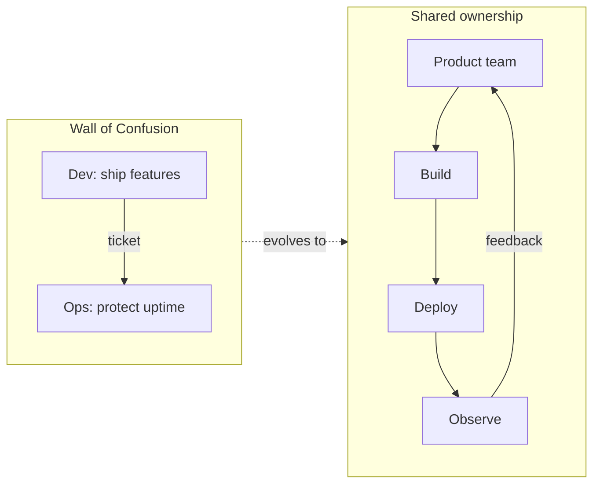

### Culture beats tooling

You can buy Jenkins, Kubernetes, and five observability vendors and still have DevOps theater if:

- Devs cannot deploy without a change-advisory board that meets weekly
- Ops is measured only on "no incidents," so they block every risk
- Nobody owns the full path from commit to customer metric

### CALMS framework

| Letter | Meaning | What good looks like |
|--------|---------|----------------------|
| **C**ulture | Shared ownership of outcomes | Blameless review; "you build it, you run it" with real support |
| **A**utomation | Repeatable paths | Same pipeline for every service; no snowflake servers |
| **L**ean | Small batches, remove waste | Feature flags; trunk-based or short-lived branches |
| **M**easurement | Feedback you trust | SLIs on user journeys, not just CPU |
| **S**haring | Knowledge flows | Runbooks, pairing on-call, open postmortems |

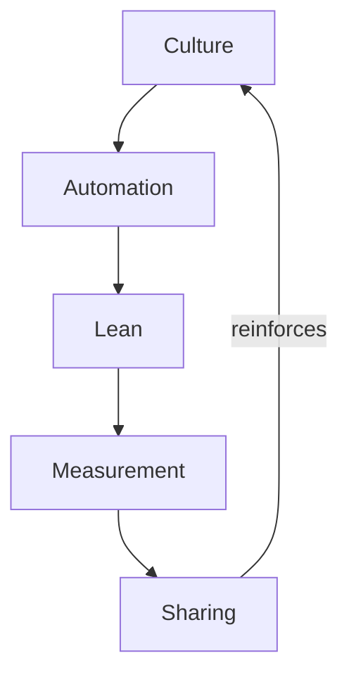

> **War Story:** At a large enterprise I supported, a "DevOps transformation" bought a PaaS and renamed the release managers. Lead time stayed at 6 weeks because the CAB still required three signatures. Tooling without authority change is cosplay. We only moved the needle when product teams got deploy rights *and* pager duty for their services.

> **Common Mistake:** Hiring a "DevOps team" that becomes a second ticket queue between Dev and Ops. That recreates the wall with a fancier name.

### Key Takeaways

- DevOps optimizes for **fast, safe change** — culture first, tools second.
- CALMS is a diagnostic checklist, not a maturity scorecard to game.
- If feedback loops are weekly and blames are personal, no amount of CI will save you.

---

## 2. Linux & networking fundamentals

You will debug production on Linux. Cloud consoles lie; `ss`, `ip`, `journalctl`, and packet captures do not.

### Processes, signals, and resources

- **PID 1** in a container is special: if it is your app and it does not reap orphans, you get zombie processes. Prefer a proper init (`tini`) or a runtime that handles it.
- **Signals:** `SIGTERM` = polite shutdown (Kubernetes sends this on pod delete); `SIGKILL` = no cleanup. Your app must drain connections on SIGTERM.
- **cgroups / namespaces:** containers are not VMs — they share the kernel. Memory limits are enforced by the OOM killer; CPU limits are time-slices.

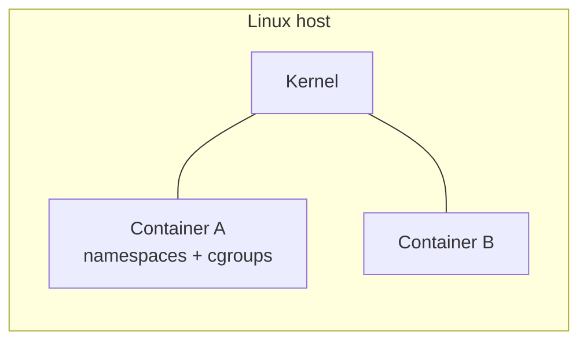

### Essential commands (muscle memory)

| Task | Command family |
|------|----------------|
| Who listens? | `ss -lntp` / `ss -s` |
| DNS | `dig` / `getent hosts` |
| Routes | `ip route`, `ip rule` |
| Disk / FS | `df -h`, `lsblk`, `findmnt`, `xfs_info` |
| I/O wait | `iostat -xz 1`, `iotop` |
| Logs | `journalctl -u <unit> -f` |
| Files held open | `lsof` / `fuser` |

### Networking model you must have in your head

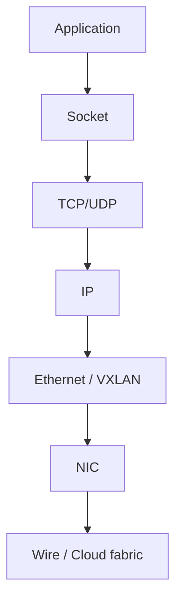

**TCP handshake & teardown:** SYN → SYN-ACK → ACK; close with FIN/ACK exchange. Half-open connections and TIME_WAIT pile up under load balancers that recycle clients aggressively — know `net.ipv4.tcp_tw_reuse` exists; do not "tune blindly."

**Ephemeral ports:** each outbound connection consumes a local port. Exhaustion looks like "Cannot assign requested address." Check `ss -s` and `sysctl net.ipv4.ip_local_port_range`.

**MTU / MSS:** cloud overlays (VXLAN, Geneve) shrink effective MTU. Path MTU black holes cause "works for small packets, hangs for large." Symptom: HTTPS hangs after ClientHello sometimes. Fix: clamp MSS or set correct MTU on instances/pods.

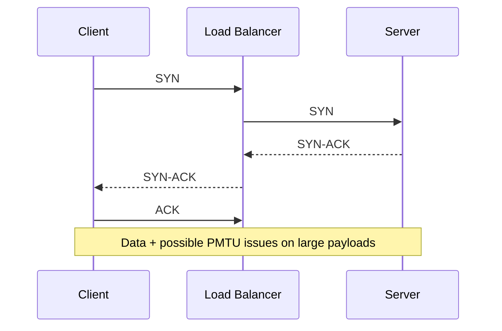

### DNS & TLS (ops view)

- TTL matters: low TTL = faster failover, more query load.
- Split-horizon DNS: internal and external answers differ — classic source of "works on my laptop."
- Certificate expiry still takes down production. Automate renewal; alert at 30/14/7 days.

> **War Story:** A payment API "randomly" timed out for ~1% of clients. Root cause: jumbo frames enabled in one AZ's VPC peering path, standard MTU elsewhere. Large POST bodies fragmented and died. Fix was consistent MTU + TCP MSS clamping on the LB. Lesson: when symptoms are size-correlated, think Layer 3/4 before application code.

### Key Takeaways

- Containers share a kernel — resource limits and signals are your contract with the orchestrator.
- Debug with `ss`, `ip`, `dig`, and MTU awareness before blaming the framework.
- DNS TTL and TLS expiry are operational controls, not afterthoughts.

---

## 3. Version control & CI/CD concepts

### Version control that scales teams

- **Trunk-based development:** short-lived branches, merge often. Long-lived feature branches are integration debt with interest.
- **Branch by abstraction / feature flags:** ship dark code; enable when ready.
- **Protected main:** required checks, no force-push, signed commits if compliance demands it.

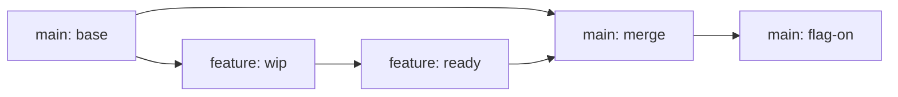

### CI vs CD (stop conflating them)

| Concept | Meaning |
|---------|---------|
| **CI** | Every commit is built and tested automatically |
| **CD (Delivery)** | Every green build is *releasable* |
| **CD (Deployment)** | Every green build is *deployed* (often with progressive delivery) |

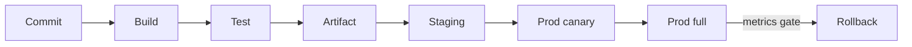

### Pipeline design principles

1. **Build once, promote the same artifact** through environments. Rebuilding for prod invites "works in staging" ghosts.
2. **Fail fast:** unit → integration → e2e. Do not run a 40-minute e2e suite before a 30-second unit failure.
3. **Idempotent deploys:** rerunning the job should not double-charge customers or double-migrate schemas without guards.
4. **Separate deploy from release:** deploy the binary; release with a flag.

> **Common Mistake:** Environment-specific builds (`npm run build:prod` that injects secrets at compile time). Prefer runtime config from a secrets store / env injected by the platform.

### Progressive delivery

| Strategy | Use when |
|----------|----------|
| Rolling | Stateless, quick rollback via previous replica set |
| Blue/green | Need instant cutover; can afford 2× capacity briefly |
| Canary | Want metric-gated risk reduction |
| Shadow | Validate new code on real traffic without user impact |

### Key Takeaways

- CI makes every commit trustworthy; CD makes every artifact shippable.
- Promote immutable artifacts; configure at runtime.
- Prefer small, reversible releases over heroic big-bang deploys.

---

## 4. Containers & orchestration fundamentals

### Why containers won

Same artifact from laptop → CI → prod. Isolation without full VM tax. The unit of deploy became the image digest, not a snowflake AMI hand-built on Friday.

### Docker essentials

- **Image = layers + config**; tag `latest` is a footgun in prod — pin digests.
- **Multi-stage builds** keep runtime images small and free of compilers.
- **HEALTHCHECK** in Dockerfile is advisory; orchestrators use their own probes.

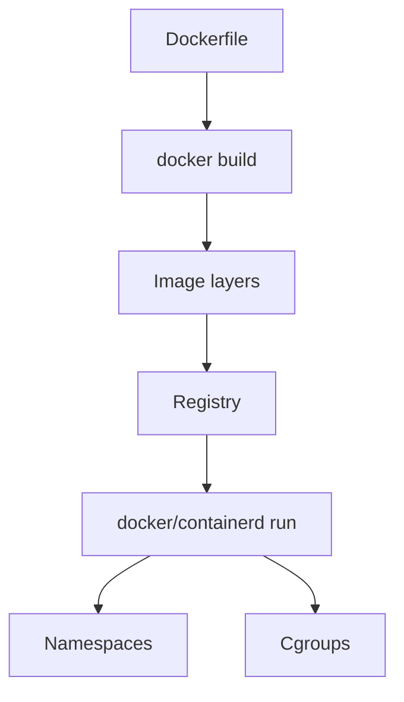

### Kubernetes core model

| Object | Role |
|--------|------|
| Pod | Smallest schedulable unit (one or more containers) |
| Deployment | Desired replica count + rolling update |
| Service | Stable virtual IP / DNS to pods |
| Ingress / Gateway | L7 entry |
| ConfigMap / Secret | Config injection |
| PVC | Persistent volume claim |

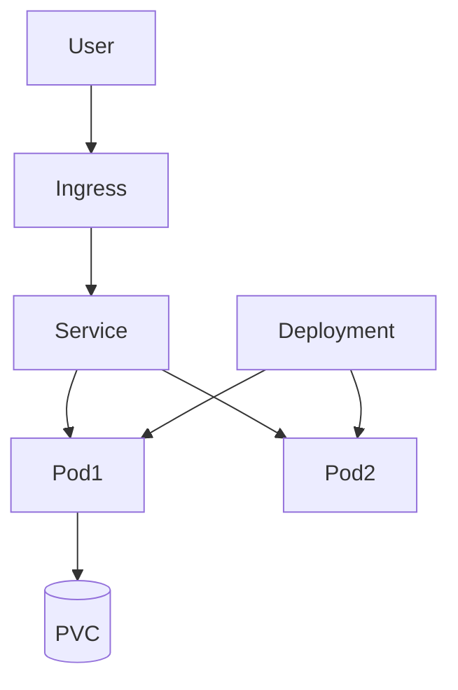

**Probes:**

- **liveness:** restart if broken (careful: do not probe a dependency or you cascade)
- **readiness:** remove from Service endpoints until ready
- **startup:** give slow apps time before liveness engages

**Scheduling:** requests (guaranteed scheduling budget) vs limits (ceiling). Memory limit breach → OOMKill. CPU limit → throttle.

> **War Story:** A team set liveness HTTP to `/health` which called the database. During a DB blip, kubelet killed every pod, amplifying the outage. Fix: liveness = process up; readiness = deps OK.

### Controllers & state

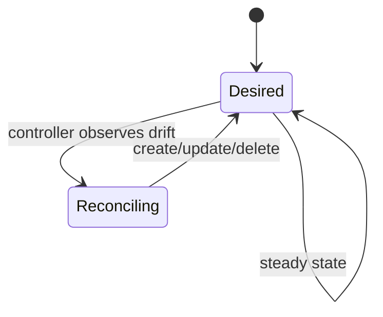

Kubernetes is a **reconciliation loop**, not a workflow engine. You declare desired state; controllers fight entropy.

### Key Takeaways

- Pin image digests in production.
- Separate liveness from readiness; never let liveness depend on downstreams.
- Think in desired state + controllers, not "SSH and fix."

---

## 5. Infrastructure as Code fundamentals

### Why IaC

If it is not in version control, it did not happen — or it will not happen the same way twice. ClickOps creates irreproducible environments and undocumented blast radius.

### Tooling landscape

| Approach | Examples | Strength |
|----------|----------|----------|
| Declarative provisioning | Terraform, Pulumi, CloudFormation, Bicep | Cloud resources as code |
| Config management | Ansible, Chef, Puppet | OS/package/app config on existing hosts |
| Immutable images | Packer + golden AMIs/images | Bake once, boot many |

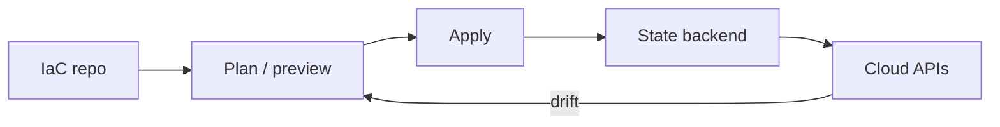

### Terraform mental model (portable across clouds)

- **Providers** talk to APIs.
- **State** maps resources to real IDs — protect it (remote backend, locking, encryption).
- **Plan before apply.** Always.
- **Modules** for reuse; do not over-abstract on day one.

### Pulumi

Same graph idea, but general-purpose languages. Better when you need real conditionals/loops/testing; worse when your org standardizes on HCL reviews.

### Config management vs provisioning

Provisioning creates the VPC and VM. Config management installs the agent. Modern preference: **immutable** (replace instances) over **mutable** (SSH and patch in place) for app tiers.

> **Common Mistake:** Committing state files or provider credentials to git. Use remote state + OIDC/workload identity for CI.

### Key Takeaways

- State is sacred — lock it, encrypt it, backup it.
- Prefer immutable infrastructure for app servers.
- Plan is a change review artifact; treat it like a PR diff.

---

## 6. Observability fundamentals

### The three pillars (plus context)

| Signal | Answers | Pitfall |
|--------|---------|---------|
| **Logs** | What happened on one request/node | Cardinality explosion; PII |
| **Metrics** | Is the system healthy *now*? | Averaging away the pain |
| **Traces** | Where did time go across services | Incomplete instrumentation |

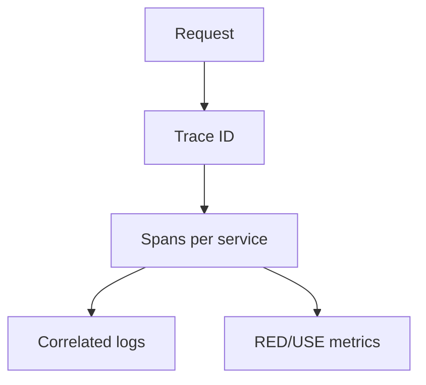

### SLI / SLO / SLA / error budgets

| Term | Definition |
|------|------------|
| **SLI** | Quantitative measure of user happiness (e.g. availability, latency p99) |
| **SLO** | Target for an SLI (e.g. 99.9% successful requests / 30 days) |
| **SLA** | Contractual consequence (credits, penalties) — legal, not engineering |
| **Error budget** | `1 − SLO`; spend it on change velocity; exhaust it → freeze risky deploys |

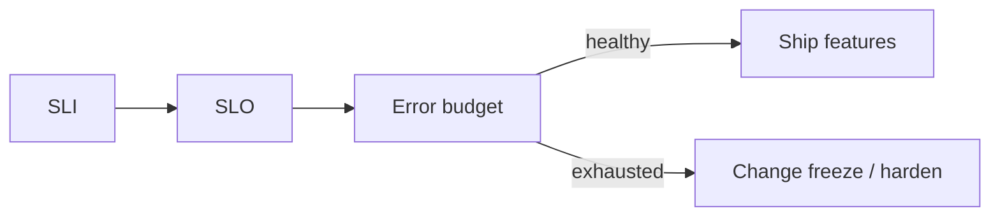

**RED method (request-driven):** Rate, Errors, Duration.  
**USE method (resources):** Utilization, Saturation, Errors.

> **War Story:** We "had 99.99% uptime" by averaging all endpoints including a health check that polled itself. Customer checkout SLI was ~99.5%. Measure the journey users pay for.

### Alerting hygiene

- Alert on **symptoms** (SLO burn) more than causes (CPU).
- Page humans for actionable, urgent issues; ticket the rest.
- Every alert needs a runbook link or it is noise.

### Key Takeaways

- Observability is about asking new questions, not collecting every byte.
- Error budgets couple reliability to release speed intentionally.
- Alert on user impact; debug with logs and traces.

---


# Part II — AWS Deep Dive

Cross-cloud quick map (keep this tattooed on your brain):

| Domain | AWS | Azure | GCP |
|--------|-----|-------|-----|
| 🔐 Identity | IAM | Entra ID + RBAC | Cloud IAM |
| 🌐 Network | VPC | VNet | VPC |
| 🖥️ VM | EC2 | Virtual Machines | Compute Engine |
| 💾 Object | S3 | Blob Storage | Cloud Storage |
| 💾 Block | EBS | Managed Disks | Persistent Disk |
| 🗄️ RDBMS | RDS/Aurora | Azure SQL | Cloud SQL |
| 🗄️ NoSQL | DynamoDB | Cosmos DB | Firestore/Bigtable |
| 🖥️ K8s | EKS | AKS | GKE |
| ⚡ Functions | Lambda | Azure Functions | Cloud Functions |
| 📊 Metrics | CloudWatch | Azure Monitor | Cloud Monitoring |

---

## II.1 🔐 IAM

IAM answers: **who** can do **what** on **which** resource, under **which** conditions.

### Principals & credentials

- **Users** (long-lived) — minimize; prefer federation.
- **Roles** — assumed via STS; temporary credentials. This is the production pattern.
- **Instance / task / pod identity** — EC2 instance profiles, ECS task roles, EKS IRSA (IAM Roles for Service Accounts). Never bake access keys into AMIs.

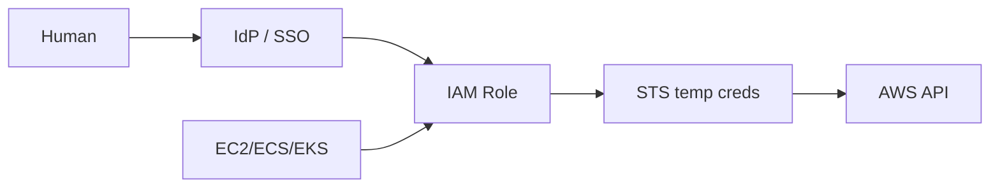

### Policies

- **Identity-based** (on user/role/group) and **resource-based** (on S3 bucket, SQS, etc.).
- Evaluation: explicit deny wins; then allow; else deny.
- Prefer **least privilege** + condition keys (`aws:SourceVpce`, `aws:PrincipalOrgID`).

> **Common Mistake:** `Action: "*"` on `Resource: "*"` in a "temporary" admin role that lives for three years.

### Organizations & SCPs

Service Control Policies set the **maximum** permissions for accounts in an OU — even root in a member account cannot exceed SCPs. Use them as guardrails (deny leaving org, deny disabling CloudTrail, deny unapproved regions).

### Key Takeaways

- Prefer roles + short-lived credentials over long-lived keys.
- Explicit deny > allow; design with SCPs as blast-radius fences.
- Workload identity (IRSA/task roles) beats embedding secrets.

---

## II.2 🌐 VPC & networking

### Building blocks

| Component | Purpose |
|-----------|---------|
| VPC | Isolated IP space (IPv4/IPv6 CIDR) |
| Subnet | AZ-scoped slice; public if route to IGW |
| Route table | Where packets go next |
| IGW | Internet gateway (public) |
| NAT GW | Egress for private subnets |
| NACL | Stateless subnet firewall |
| Security Group | Stateful instance/ENI firewall |
| VPC endpoints | Private access to AWS APIs (Gateway for S3/DynamoDB; Interface for others) |

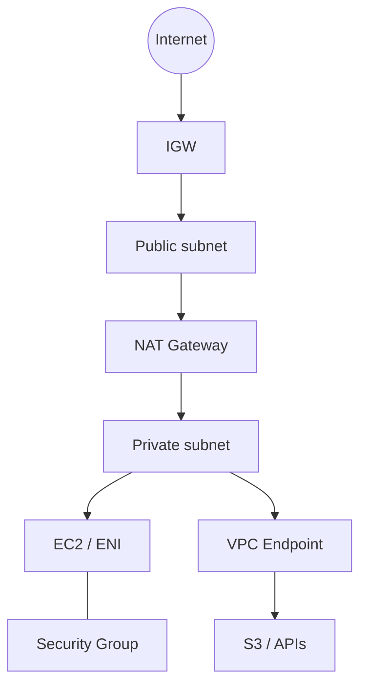

**Design defaults that age well:**

- At least **/16** VPC if you expect growth; do not paint yourself into `/24` hell.
- Private subnets for apps; public only for load balancers / bastion alternatives (prefer SSM Session Manager over bastions).
- Multi-AZ by default for anything stateful-ish.

**Peering vs Transit Gateway:** Peering is 1:1 and does not transit. TGW is the hub for many VPCs — costs money; worth it past a handful of VPCs.

### Key Takeaways

- SGs are your primary host firewall; NACLs are coarse edge controls.
- Private + endpoints beats "NAT everything" for both security and cost at scale.
- Plan CIDRs for peering/hybrid before you have 40 accounts.

---

## II.3 🖥️ EC2 & Auto Scaling

### Instance selection (practical)

- **Burstable (T):** cheap until you run out of credits — bad for sustained CPU.
- **General (M), Compute (C), Memory (R):** pick based on bottleneck, not brand familiarity.
- **Graviton (ARM):** often better price/performance if your stack supports it.

### Auto Scaling Groups (ASG)

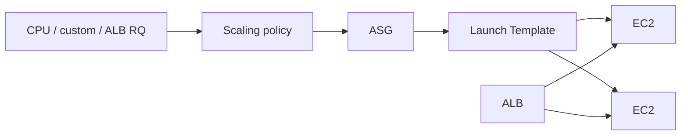

- Prefer **launch templates** over launch configs.
- Mix **On-Demand + Spot** with capacity-optimized allocation for fault-tolerant fleets.
- Warm pools / instance refresh for faster scale-out and controlled replacement.

> **War Story:** An ASG scaled on average CPU across 50 instances. One hot shard pegged a node while the average looked fine. Custom per-queue depth metrics fixed it. Averages hide pain.

### Key Takeaways

- Launch templates + multi-AZ ASGs are the baseline.
- Scale on saturation signals that match user pain, not vanity CPU.
- Spot is a discount with an eviction contract — design for interruption.

---

## II.4 💾 Storage: EBS, EFS, S3

| Service | Type | Use |
|---------|------|-----|
| **EBS** | Block, AZ-scoped | Boot + databases on single instance |
| **EFS** | NFS (regional) | Shared files across AZs |
| **S3** | Object | Durable blob store; not a POSIX FS |

### EBS essentials

- Volume types: **gp3** (default general), **io2** (high IOPS), **st1/sc1** (throughput/cold HDD — niche).
- Snapshots are incremental, stored in S3 behind the scenes.
- Encrypt by default with KMS.
- An EBS volume lives in **one AZ**. Detach/attach within that AZ (see Part V Ch. 8).

### S3 storage classes (conceptual)

| Class | When |
|-------|------|
| Standard | Hot |
| Intelligent-Tiering | Unknown/changing access |
| Standard-IA / One Zone-IA | Infrequent |
| Glacier Instant / Flexible / Deep Archive | Archive (restore times vary) |

Lifecycle policies move data; versioning + MFA delete protect against ransomware-ish deletes.

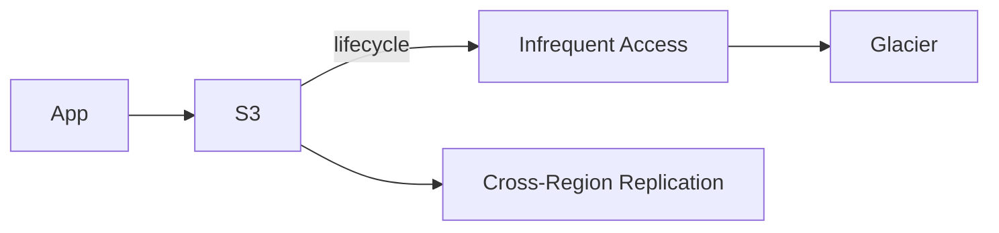

### Key Takeaways

- EBS ≠ durable multi-AZ by itself; pair with snapshots/replication strategy.
- S3 is the durability workhorse; design keys and prefixes for request rate.
- EFS is convenient and not free — watch provisioned throughput and backups.

---

## II.5 🗄️ Databases: RDS, Aurora, DynamoDB

### RDS / Aurora

- Managed engines: Postgres, MySQL, etc.
- **Multi-AZ:** sync standby for failover (RDS); Aurora has replicas and storage that spans AZs.
- Read replicas for scale-out reads; beware replication lag.
- Parameter groups, option groups, maintenance windows — own them or they will surprise you.

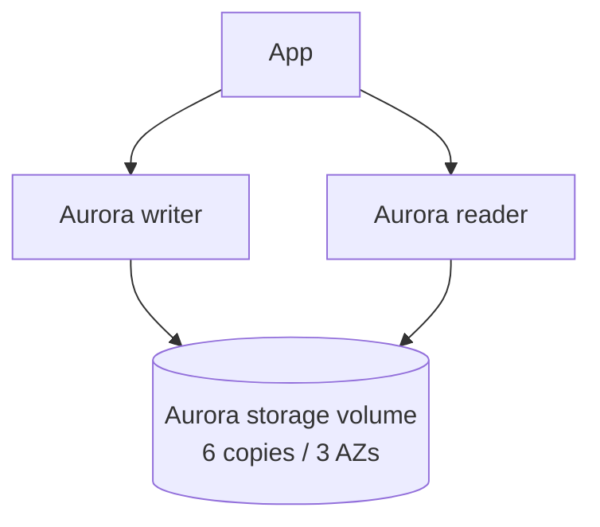

### DynamoDB

- Key-value / document; single-digit ms at any scale *if* your access patterns fit.
- Partition key design is everything — hot partitions kill you.
- On-Demand vs Provisioned + Auto Scaling; Global Tables for multi-region.
- Strong vs eventual consistent reads — trade cost/latency/consistency.

| Choose | If |
|--------|-----|
| Aurora/RDS | Relational queries, transactions, mature SQL ops |
| DynamoDB | Known access patterns, massive scale, serverless ops |

### Key Takeaways

- Model DynamoDB around queries, not entities-first ERDs.
- Aurora storage architecture removes a class of disk-failover pain — still test failover.
- Always know your RPO/RTO for automated backups vs continuous replication.

---

## II.6 🖥️ ECS & EKS

| | ECS | EKS |
|--|-----|-----|
| Abstraction | AWS-native tasks/services | Upstream Kubernetes |
| Learning curve | Lower | Higher |
| Portability | AWS-centric | Multi-cloud / CNCF ecosystem |
| Networking | awsvpc common | CNI / custom CNIs |

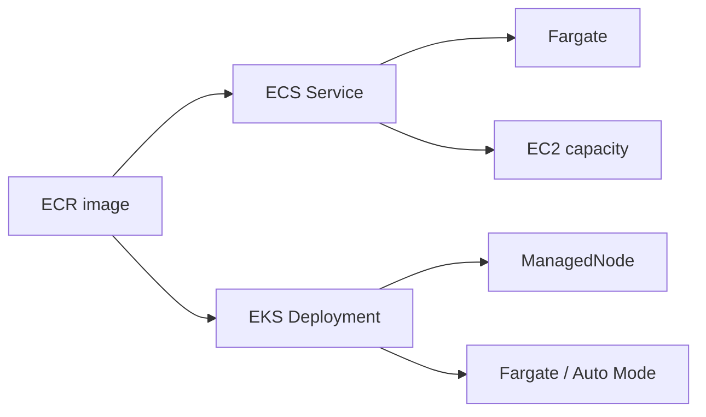

**IRSA** on EKS: pods assume IAM roles via OIDC — required pattern for least privilege.

### Key Takeaways

- ECS if you want AWS-shaped containers fast; EKS if you need K8s ecosystem/portability.
- Fargate trades control for less node babysitting — great until you need GPUs/daemonsets/custom CNI.
- Cluster upgrades are a product risk; schedule them.

---

## II.7 ⚡ Lambda & serverless

- Event sources: API Gateway, SQS, S3, EventBridge, etc.
- **Cold starts** matter for sync APIs (especially VPC-attached Lambdas).
- Timeouts max out (check current docs — historically 15 minutes); do not pretend it is a batch cluster.
- Concurrency limits are account/regional — reserved concurrency protects critical functions and can starve others.

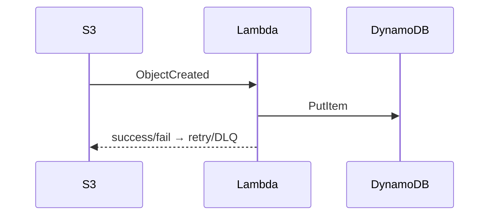

### Key Takeaways

- Use DLQs / failure destinations; silent retries hide poison messages.
- Prefer async + queues for bursty workloads.
- VPC Lambda needs capacity planning for ENIs (improved over years, still design carefully).

---

## II.8 Infrastructure as Code: CloudFormation

- Native AWS IaC; stacks + change sets.
- Drift detection exists; still verify before "helpful" updates.
- CDK synthesizes to CloudFormation — same deployment engine, better abstractions for some teams.
- Nested stacks / StackSets for multi-account.

```mermaid
flowchart LR
  Template --> ChangeSet
  ChangeSet --> Review
  Review --> Stack[CloudFormation Stack]
  Stack --> Resources
```

### Key Takeaways

- Always review change sets in prod.
- CloudFormation is eventually consistent with reality only if you stop ClickOps.

---

## II.9 📊 CloudWatch & X-Ray

- **Metrics, Logs, Alarms, Dashboards.**
- Log Insights for queries; watch ingestion cost.
- **X-Ray / ADOT** for traces; sample thoughtfully.
- Composite alarms and anomaly detection reduce toil when tuned — they also cry wolf when not.

### Key Takeaways

- Align alarms to SLOs, not every metric spike.
- High-cardinality custom metrics will surprise your bill.

---

## II.10 🌐 Route 53 & CloudFront

**Route 53 policies:** simple, failover, weighted, latency, geolocation/geoproximity. Health checks drive failover — test them; a bad health check is an outage generator.

**CloudFront:** CDN + TLS termination + WAF association + origin failover. Cache key design determines hit ratio (and origin bill).

```mermaid
flowchart LR
  User --> R53[Route 53]
  R53 --> CF[CloudFront]
  CF --> Origin[ALB / S3 / custom]
```

### Key Takeaways

- DNS failover needs working health checks and realistic TTLs.
- CDN is a cache — invalidate carefully; prefer versioned objects.

---

## II.11 💰 Cost management

| Lever | Notes |
|-------|-------|
| **Reserved Instances** | Commitment discount; less flexible |
| **Savings Plans** | $/hour commitment; Compute SP covers EC2/Fargate/Lambda broadly |
| **Spot** | Deep discount; interruption possible |
| **Right-sizing** | Still the biggest free win |
| **Storage lifecycle** | S3/EBS snapshots accrue quietly |

Use Cost Explorer, Budgets, and allocation tags (`Environment`, `Team`, `Service`). Untagged resources are orphaned spend.

> **War Story:** A forgotten gp2 volume farm from a migrated stateful set cost more per month than the new Aurora cluster. Snapshot hygiene and volume GC paid for a headcount month.

### Key Takeaways

- Commitment discounts after right-sizing, not before.
- Tag ruthlessly; review idle EIPs, unattached EBS, old snapshots.

---

## II.12 Well-Architected Framework

Six pillars (AWS current framing): **Operational Excellence, Security, Reliability, Performance Efficiency, Cost Optimization, Sustainability.**

Use the Well-Architected Tool for reviews — treat findings as a backlog, not a certification plaque.

```mermaid
flowchart TB
  WA[Well-Architected Review] --> OE[Ops]
  WA --> Sec[Security]
  WA --> Rel[Reliability]
  WA --> Perf[Performance]
  WA --> Cost[Cost]
  WA --> Sust[Sustainability]
```

### Key Takeaways

- Frameworks structure conversations; they do not replace production evidence.
- Re-review after major architecture changes.

---


# Part III — Azure Deep Dive

Azure maps cleanly onto the same mental model as AWS with different nouns. The sharp edges are **Entra ID tenancy**, **subscription/management group hierarchy**, and **RBAC scope**.

---

## III.1 🔐 Azure AD / Entra ID

- **Tenant** = directory boundary.
- **Subscriptions** nest under **management groups** for policy at scale.
- Identities: users, groups, **service principals**, **managed identities** (system/user-assigned).

```mermaid
flowchart TB
  MG[Management Groups] --> Sub[Subscriptions]
  Sub --> RG[Resource Groups]
  RG --> Res[Resources]
  MI[Managed Identity] --> Res
  SP[Service Principal] --> API[Azure Resource Manager]
  Human --> Entra[Entra ID]
  Entra --> RBAC
  RBAC --> MG
  RBAC --> Sub
  RBAC --> RG
```

**RBAC roles:** Owner / Contributor / Reader plus many built-in job roles. Prefer custom roles only when built-ins are too wide. Assign at the **narrowest scope** that works.

**Conditional Access** and PIM (Privileged Identity Management) for just-in-time admin — use them in any regulated shop.

> **Common Mistake:** Giving Contributor at subscription scope to a CI service principal "so pipelines work." That principal can delete networks.

### Key Takeaways

- Managed identities replace secrets for Azure-to-Azure auth.
- Scope RBAC tightly; use PIM for standing admin rights.
- Management groups + Azure Policy are your SCP equivalent.

---

## III.2 🌐 VNets

| Concept | Azure | Notes |
|---------|-------|-------|
| Network | VNet | Regional |
| Segmentation | Subnets | NSGs associate at NIC or subnet |
| Ingress | Public IP / LB / App Gateway / Front Door | Pick by L4 vs L7 needs |
| Egress | NAT Gateway | Prefer over instance-level public IPs |
| Private access | Private Endpoint / Private Link | To PaaS |
| Hub-spoke | Peering + Hub firewall | Common enterprise pattern |

```mermaid
flowchart TB
  Internet --> FD[Front Door / App Gateway]
  FD --> SpokeApp[Spoke VNet - App]
  SpokeApp --> Hub[Hub VNet]
  Hub --> OnPrem[ExpressRoute / VPN]
  SpokeApp --> PE[Private Endpoint]
  PE --> PaaS[Azure SQL / Storage]
```

**NSG vs Azure Firewall:** NSGs are distributed allow/deny; Firewall is centralized policy, IDPS options, egress FQDN filtering. Do not pretend NSGs alone are an enterprise egress strategy.

### Key Takeaways

- Hub-spoke + Private Link is the default enterprise shape.
- Plan address spaces for peering; overlapping CIDRs are painful.
- Prefer Private Endpoints for data-plane PaaS.

---

## III.3 🖥️ VMs & Scale Sets

- **Availability Sets** vs **Availability Zones** — zones are the modern HA story where the region supports them.
- **Virtual Machine Scale Sets (VMSS):** autoscale, rolling upgrades, Spot mixed.
- Extensions and **cloud-init** for bootstrap; prefer image baking (Azure Image Builder / Packer).

```mermaid
flowchart LR
  Metric[Autoscale metric] --> VMSS
  VMSS --> VM1
  VMSS --> VM2
  LB[Load Balancer / App Gateway] --> VM1
  LB --> VM2
```

### Key Takeaways

- Zone-redundant for production; test platform maintenance behavior.
- Scale sets + health probes beat hand-managed VM farms.

---

## III.4 💾 Managed Disks & Blob Storage

### Managed Disks

| Type | Role |
|------|------|
| Premium SSD / Premium SSD v2 | Prod IOPS-sensitive |
| Standard SSD | General |
| Ultra Disk | Extreme latency/IOPS |
| Standard HDD | Backups/cold (rare for OS) |

Disks are zonal (or zone-redundant for some shared disk scenarios). Snapshots and **Azure Backup** / Site Recovery for DR. Resize runbook: Part V Ch. 8.

### Blob Storage

| Tier | Use |
|------|-----|
| Hot | Frequent |
| Cool | Infrequent |
| Cold | Rare (check regional availability/docs) |
| Archive | Offline-ish; rehydrate required |

Access tiers + lifecycle management mirror S3 thinking. **ADLS Gen2** hierarchical namespace for analytics.

```mermaid
flowchart LR
  App --> Blob
  Blob -->|lifecycle| Cool
  Cool --> Archive
```

### Key Takeaways

- Managed Disks are the EBS analogue — zone affinity matters for attach.
- Blob lifecycle and immutability policies are ransomware defenses.
- Do not use Blob as a high-IOPS database disk.

---

## III.5 🗄️ Azure SQL & Cosmos DB

**Azure SQL:** single DB, elastic pools, Managed Instance (near feature-parity with SQL Server). Geo-replication / Failover Groups for DR.

**Cosmos DB:** multi-model (NoSQL API common), turn-key global distribution, tunable consistency levels (strong → eventual, with well-documented intermediates). RU/s provisioning is the cost/perf dial — partition key design dominates.

```mermaid
flowchart TB
  App --> SQL[Azure SQL / MI]
  App --> Cosmos[Cosmos DB]
  Cosmos --> RegionA
  Cosmos --> RegionB
```

| Choose | If |
|--------|-----|
| Azure SQL / MI | Relational, T-SQL, existing SQL Server estates |
| Cosmos | Global distribution, flexible schema, RU-based scale |

### Key Takeaways

- Cosmos consistency choice is a product decision, not a checkbox.
- Elastic pools smooth cost across many small DBs.

---

## III.6 🖥️ AKS

- Managed control plane; you own node pools (or use virtual nodes / Autopilot-like offerings as they evolve — verify current SKU names in docs).
- **Azure AD / Entra workload identity** for pod→Azure auth (successor thinking to pod-managed-identity patterns).
- Azure CNI vs kubenet/overlay — CNI needs larger IP budgets; plan VNet accordingly.
- Ingress: Application Gateway Ingress Controller or other ingress + Front Door in front for global.

```mermaid
flowchart LR
  User --> AGW[App Gateway / Front Door]
  AGW --> Ingress
  Ingress --> Pods
  Pods --> WI[Workload Identity]
  WI --> AzurePaaS[Key Vault / Storage]
```

### Key Takeaways

- IP planning for Azure CNI is a day-0 decision.
- Upgrade node pools deliberately; surge settings matter.
- Bind pods to Azure APIs via workload identity, not secrets in Key Vault mounted ad hoc without rotation.

---

## III.7 ⚡ Azure Functions

- Hosting plans: **Consumption**, **Premium**, **Dedicated** (App Service plan).
- Triggers/bindings reduce glue code; durable functions for orchestrations.
- Cold start and VNet integration trade-offs similar to Lambda.

### Key Takeaways

- Premium plan when you need VNET + preditable cold starts.
- Use poison message handling on queue triggers.

---

## III.8 ARM / Bicep

- **ARM templates:** JSON, verbose.
- **Bicep:** DSL that compiles to ARM — prefer Bicep for human-authored IaC on Azure.
- Deployments are scoped to resource group / subscription / management group.
- What-if deployments ≈ Terraform plan.

```mermaid
flowchart LR
  Bicep --> ARM[ARM JSON]
  ARM --> WhatIf
  WhatIf --> Deploy
  Deploy --> AzureGraph[Azure resource graph]
```

### Key Takeaways

- Bicep + what-if in CI before prod apply.
- Azure Policy can deny non-compliant resources regardless of who deploys.

---

## III.9 📊 Azure Monitor

- **Metrics, Logs (Log Analytics), Alerts, Application Insights.**
- Kusto Query Language (KQL) is the power tool — learn a core set of joins/summarizes.
- Action Groups route to email/SMS/webhook/ITSM.

### Key Takeaways

- App Insights + OpenTelemetry correlation beats siloed logs.
- Log Analytics retention and ingestion pricing need explicit design.

---

## III.10 🌐 Front Door / CDN

- **Azure Front Door:** global anycast L7, WAF, routing/rules.
- **Azure CDN** (profiles vary by SKU/product generation — check current product names) for static acceleration.
- Combine Front Door → App Gateway/AKS or Storage static website.

```mermaid
flowchart LR
  Client --> AFD[Front Door]
  AFD --> OriginA[Region A]
  AFD --> OriginB[Region B]
```

### Key Takeaways

- Global entry ≠ regional HA of origins — still design origin failover.
- Cache rules and private origins need deliberate Private Link patterns.

---

## III.11 💰 Cost management

- **Reservations** and **Savings Plans** analogues exist; Azure Hybrid Benefit for Windows/SQL licenses.
- Cost Management + Budgets + tags; **Azure Advisor** for recommendations (verify before applying).
- Spot VMs / Spot node pools for interruptible work.

### Key Takeaways

- License mobility (AHB) can dwarf compute discounts — involve FinOps early.
- Orphaned disks and public IPs show up every audit.

---

## III.12 Azure Well-Architected Framework

Pillars align closely with AWS: reliability, security, cost, operational excellence, performance efficiency (Microsoft documentation is the source of truth for exact pillar naming/updates).

Use architecture reviews against Azure-specific offerings (Front Door, Cosmos consistency, zone support per region).

### Key Takeaways

- Region feature parity is uneven — design to the region you deploy, not the marketing slide.
- Policy + Blueprint/Template specs encode WAF decisions.

---

# Part IV — GCP Deep Dive

GCP's distinctive strengths historically: **global VPC thinking**, **data/analytics**, and **GKE** maturity. IAM is resource-hierarchical and worth learning properly.

---

## IV.1 🔐 IAM

- Hierarchy: **Organization → Folder → Project → Resource**.
- Roles: basic (Owner/Editor/Viewer — too blunt for prod), predefined, custom.
- **Prefer service accounts** for workloads; use **Workload Identity Federation** / GKE Workload Identity instead of JSON keys.

```mermaid
flowchart TB
  Org[Organization] --> Folder
  Folder --> Project
  Project --> SA[Service Account]
  SA --> Binding[IAM policy binding]
  Binding --> Role
  Role --> Resource
```

> **Common Mistake:** Downloading service account user-managed keys into CI. Prefer WIF from GitHub/GitLab OIDC.

### Key Takeaways

- Policies inherit down the hierarchy; use conditions carefully.
- Kill JSON keys as a culture.

---

## IV.2 🌐 VPC

- VPC can be **global**; subnets are **regional**.
- Shared VPC for hub-style multi-project networking.
- **Cloud NAT**, **Private Google Access**, **Private Service Connect** for private consumption of APIs/services.
- Firewall rules are global to the VPC (priority + tags/service accounts as targets).

```mermaid
flowchart TB
  Internet --> HTTPS_LB[Global HTTPS LB]
  HTTPS_LB --> NEG[NEG / backends]
  NEG --> SubnetA[Subnet region A]
  NEG --> SubnetB[Subnet region B]
  SubnetA --> NAT[Cloud NAT]
  SubnetA --> PGA[Private Google Access]
```

### Key Takeaways

- Global HTTP(S) Load Balancing is a first-class design center on GCP.
- Shared VPC needs clear host/service project ownership or you get networking gridlock.

---

## IV.3 🖥️ Compute Engine & MIGs

- **Managed Instance Groups (MIGs):** autoscaling, autohealing, rolling updates.
- **Spot VMs** (preemptible lineage) for batch.
- Sole-tenant / GPUs as needed; machine families (E2, N2, C3, etc.) — pick from current families in docs.

```mermaid
flowchart LR
  Autoscaler --> MIG
  MIG --> VM1
  MIG --> VM2
  HealthCheck --> MIG
  LB --> MIG
```

### Key Takeaways

- Autohealing requires a real health check — not just "process exists."
- Stateful MIGs exist; prefer stateless when you can.

---

## IV.4 💾 Persistent Disks & Cloud Storage

### Persistent Disk

- Zonal or regional (replicated) PDs.
- Types: standard, balanced, SSD, extreme — match IOPS/throughput needs.
- Snapshots are incremental; schedule via snapshot policies.
- Resize online often possible; still follow Part V Ch. 8 discipline for detach scenarios.

### Cloud Storage

| Class | Typical use |
|-------|-------------|
| Standard | Hot |
| Nearline | Monthly-ish |
| Coldline | Quarterly-ish |
| Archive | Yearly-ish |

Object versioning, retention policies, Autoclass. Uniform bucket-level access simplifies IAM vs ACLs.

```mermaid
flowchart LR
  App --> GCS[Cloud Storage]
  GCS -->|Autoclass/lifecycle| Nearline
  Nearline --> Archive
```

### Key Takeaways

- Regional PD for HA of a single VM's disk across zones — know the cost.
- Uniform bucket IAM > fine-grained ACLs for sane ops.

---

## IV.5 🗄️ Cloud SQL, Spanner, Bigtable

| Service | Model | Strength |
|---------|-------|----------|
| **Cloud SQL** | Managed MySQL/Postgres/SQL Server | Familiar RDBMS |
| **Spanner** | Globally distributed relational | Strong consistency + horizontal scale |
| **Bigtable** | Wide-column | High throughput analytics/time-series |

```mermaid
flowchart TB
  OLTP[OLTP app] --> CloudSQL
  Global[Global strongly consistent] --> Spanner
  Telemetry[High write telemetry] --> Bigtable
```

Spanner is not "Postgres with magic" — schema/key design and external consistency semantics differ. Worth it when multi-region strong consistency is a hard requirement.

### Key Takeaways

- Cloud SQL HA config ≠ Spanner global.
- Bigtable row key design dominates performance.

---

## IV.6 🖥️ GKE

- **Standard** vs **Autopilot** (Google manages nodes more aggressively).
- Release channels: rapid/regular/stable.
- Workload Identity for GCP API access.
- Dataplane V2 / network policies for segmentation.

```mermaid
flowchart LR
  User --> GCLB[Global LB]
  GCLB --> GKEIngress[GKE Gateway/Ingress]
  GKEIngress --> Pods
  Pods --> WI[Workload Identity]
  WI --> GCPapis[GCS / PubSub]
```

### Key Takeaways

- Autopilot reduces node toil; watch constraints on daemons/privileges.
- Control plane upgrades still need app readiness (PDBs, probes).

---

## IV.7 ⚡ Cloud Functions & Cloud Run

- **Cloud Functions:** event-driven functions (generations evolved — prefer current gen in new work).
- **Cloud Run:** containerized services, scales to zero, request-driven or always-on min instances.
- Many teams prefer Cloud Run over Functions when they already ship containers.

```mermaid
sequenceDiagram
  participant PubSub
  participant Run as Cloud Run
  participant SQL as Cloud SQL
  PubSub->>Run: push/pull message
  Run->>SQL: query
  Run-->>PubSub: ack/nack
```

### Key Takeaways

- Cloud Run is often the sweet spot for container microservices on GCP.
- Set concurrency and min instances deliberately for latency SLOs.

---

## IV.8 Terraform on GCP

Terraform is first-class here (Google's own examples skew Terraform). Patterns:

- Remote state on GCS + state locking (e.g. with appropriate backend locking mechanism — verify current recommended locking).
- Provider `google` / `google-beta`.
- Modularize by project/environment; use folders for blast radius.

```mermaid
flowchart LR
  TF[Terraform] --> Plan
  Plan --> Apply
  Apply --> GCPAPIs[GCP APIs]
  State[(GCS state)] --- TF
```

### Key Takeaways

- Separate state per environment/project to limit blast radius.
- Use WIF for CI applies.

---

## IV.9 📊 Cloud Monitoring & Logging

- Formerly Stackdriver; now **Cloud Monitoring** + **Cloud Logging** + **Cloud Trace/Profiler**.
- Log-based metrics; alerting policies; SLOs as first-class Monitoring concepts.
- Ops Agent on VMs; GKE integrations.

### Key Takeaways

- Define SLOs in Monitoring and alert on burn rate.
- Exclusion filters control logging cost.

---

## IV.10 🌐 Cloud CDN

- Integrates with external Application Load Balancers.
- Cache modes, signed URLs, invalidation.
- Pair with Cloud Armor for WAF/DDoS posture.

```mermaid
flowchart LR
  User --> CDN[Cloud CDN]
  CDN --> URLMap[URL Map / LB]
  URLMap --> Backend[Backend service / GCS backend bucket]
```

### Key Takeaways

- CDN hit ratio is an architecture metric — design cache keys.
- Armor policies need tuning to avoid blocking legit traffic.

---

## IV.11 💰 Cost management

- Sustained use discounts (automatic historically for GCE — verify current mechanics), **CUDs** (Committed Use Discounts), Spot.
- Recommender for idle resources; budgets and quotas.
- BigQuery/storage analytics often dominate bills — FinOps must include data teams.

### Key Takeaways

- CUDs after stable baseline.
- Quotas are both protection and footgun during scale events — request early.

---

## IV.12 GCP Architecture Framework

Google's architecture framework emphasizes similar themes: system design, operational excellence, security, reliability, cost. Use official framework checklists during design reviews; validate region/service availability for your chosen locations.

```mermaid
flowchart TB
  Design[Design review] --> Rel[Reliability]
  Design --> Sec[Security]
  Design --> Cost[Cost]
  Design --> Perf[Performance]
  Design --> Ops[Ops excellence]
```

### Key Takeaways

- GCP shines when you lean into global LB + managed data services deliberately.
- Do not import AWS network patterns 1:1 — use global VPC/LB strengths.

---


# Part V — Cross-Cloud & Advanced Operations

---

## 7. Multi-cloud and hybrid-cloud strategy

### When multi-cloud is worth it

| Valid reason | Invalid reason |
|--------------|----------------|
| Acquisition left you with two clouds | "Avoid lock-in" without a portability plan |
| Specific managed service (e.g. one vendor's ML/data offering) | Resume-driven architecture |
| Regulatory data residency forcing split | Blind failover fantasy across clouds with no tested RTO |
| Negotiating leverage *after* you have portable workloads | Doubling every control plane "for HA" |

**Hybrid** (on-prem + cloud) is common and often justified: latency to factories, mainframe adjacency, gradual migration. **Active-active multi-cloud** for the same app is rare, expensive, and usually under-tested.

```mermaid
flowchart TB
  Q{Why multi-cloud?} -->|Acquisition / unique service / residency| OK[Scoped multi-cloud]
  Q -->|Fear of lock-in only| NO[Stay single-cloud;<br/>invest in IaC + containers]
  OK --> Pattern[Patterns: data gravity stays;<br/>portable app tier; shared IdP]
```

### Practical pattern

- One **primary cloud** for a given bounded context.
- Portable packaging (containers) + IaC modules per cloud where needed.
- Central identity (Okta/Entra) and observability that can federate.
- Do **not** mirror every subnet across clouds "just in case."

> **War Story:** A program mandated "active-active AWS+Azure" for a stateful monolith. Dual-write to two databases "temporarily" became permanent. Consistency bugs cost more than any outage the dual cloud was meant to prevent. We collapsed to AWS primary + Azure DR cold standby with tested restore — cheaper and more honest.

### Key Takeaways

- Multi-cloud is a product/org constraint strategy, not a default HA pattern.
- Portability comes from architecture discipline, not from running everything everywhere.
- Hybrid needs first-class network and identity design, not a VPN afterthought.

---

## 8. CASE STUDY: Detaching, resizing, and reattaching a cloud block storage volume in production

> **Audience:** on-call engineer. Treat this as a runbook. If you do not understand a step, stop and escalate — guessing with disks is how you get silent corruption.

### 8.0 Decision: do you need detach at all?

| Goal | Prefer |
|------|--------|
| Grow filesystem on **online-resizable** volume already attached | Online resize (cloud grow + `resize2fs`/`xfs_growfs`) — **no detach** |
| Change volume type / move instance / stuck attach | Detach path below |
| Shrink volume | Generally **not supported** in-place — migrate data to smaller volume |

**If online grow works, do that.** Detach is for when the platform or situation requires it.

```mermaid
stateDiagram-v2
  [*] --> AttachedInUse
  AttachedInUse --> SnapshotTaken: pre-check OK
  SnapshotTaken --> Unmounted: app stopped / FS unmounted
  Unmounted --> Detached: cloud detach
  Detached --> Resized: cloud modify size/type
  Resized --> Attached: cloud attach
  Attached --> FSGrown: resize2fs / xfs_growfs
  FSGrown --> Remounted: mount + start app
  Remounted --> Verified: checks pass
  Verified --> [*]
  SnapshotTaken --> RolledBack: failure → restore snapshot / old volume
  Detached --> RolledBack
  Attached --> RolledBack
```

### 8.1 Pre-checks (all clouds)

1. **Change window** approved; stakeholders know write downtime.
2. Identify: instance/VM ID, volume/disk ID, device name (`/dev/nvme…`, `/dev/sdX`, `/dev/disk/azure/…`, `/dev/disk/by-id/google-…`), mountpoint, FS type (`df -Th`, `findmnt`, `lsblk -f`).
3. Confirm **no nested dependency** (Docker root, kubelet data, etcd) unless you intend full node drain.
4. **LVM?** If PV spans the disk: note VG/LV names; you will `pvresize` then `lvextend` then FS grow.
5. **RAID / mdadm / striped LVM?** Stop — different procedure; do not follow single-disk steps blindly.
6. Disk space monitoring: record current size, inode usage (`df -i`).
7. Take a **snapshot / backup** and wait until it reports **successful / completed**. Note snapshot ID.
8. Flush & quiesce: stop writes (stop app or `fsfreeze` if supported and you know the implications), then sync.

```mermaid
flowchart TB
  Start[Start] --> ID[Identify disk + FS + LVM]
  ID --> Snap[Create snapshot; wait COMPLETE]
  Snap --> Quiesce[Stop app / drain node]
  Quiesce --> Umount[umount cleanly]
  Umount --> Detach[Cloud detach]
  Detach --> Resize[Modify size]
  Resize --> Attach[Cloud attach]
  Attach --> Grow[Grow PV/LV/FS]
  Grow --> Mount[mount + start]
  Mount --> Verify[Verify]
```

### 8.2 Safe unmount

```bash
# Confirm nothing is using the mount
sudo lsof +f -- /mount/point   # or fuser -vm /mount/point
sudo sync
# Optional: fsfreeze -f /mount/point  (only if trained for your FS/app)
sudo umount /mount/point
# If busy: systemctl stop <app>, drain pods, close NFS clients, then retry
```

**fsck considerations:**

- After crash/unclean unmount, run FS check **before** trusting data:
  - ext4: `sudo fsck -n /dev/…` (dry) then `fsck -f` if needed — **only on unmounted volume**
  - xfs: `xfs_repair -n` then `xfs_repair` — never on mounted FS
- Clean unmount after orderly stop usually skips repair.

**LVM:**

```bash
sudo lvs; sudo pvs; sudo vgs
# After size increase and reattach:
sudo pvresize /dev/…
sudo lvextend -l +100%FREE /dev/vg/lv   # or -L +XXg
# then filesystem grow on the LV device
```

### 8.3 Cloud-specific detach / resize / attach

#### AWS EBS

| Step | Action |
|------|--------|
| Snapshot | `CreateSnapshot` on volume; wait `completed` |
| Detach | Stop instance **or** unmount then `DetachVolume` (root volume usually requires stop) |
| Resize | `ModifyVolume` new size (and type/IOPS if needed); wait `optimizing`/`completed` |
| Attach | `AttachVolume` same AZ; note device name (NVMe names may shift — use UUID in fstab!) |
| OS | `growpart` if partition; then `resize2fs` or `xfs_growfs` |

```mermaid
sequenceDiagram
  participant Eng as Engineer
  participant OS as Guest OS
  participant AWS as AWS API
  Eng->>OS: stop app, umount
  Eng->>AWS: CreateSnapshot (wait completed)
  Eng->>AWS: DetachVolume
  Eng->>AWS: ModifyVolume (size)
  Eng->>AWS: AttachVolume
  Eng->>OS: growpart / pvresize / resize FS
  Eng->>OS: mount, start app, verify
```

**AWS notes:** Volume and instance must share AZ. Root volume detach typically needs instance stop. NVMe device paths can change — **fstab by UUID**.

#### Azure Managed Disks

| Step | Action |
|------|--------|
| Snapshot | Create snapshot of managed disk; wait success |
| Detach | Deallocate VM **or** detach data disk from VM (portal/CLI/ARM) |
| Resize | Disk must be **unattached** (or follow current docs for online expand — prefer documented online expand when available) → update disk size GB |
| Attach | Attach to VM; Linux may need to detect device |
| OS | Same partition/LVM/FS grow |

**Azure notes:** Some SKUs/tiers have size-change constraints. Ultra Disk and shared disks have extra rules — read SKU docs. Prefer **UUID** in fstab. If using Azure Disk Encryption, confirm keys/unwrap still valid post-reattach.

#### GCP Persistent Disk

| Step | Action |
|------|--------|
| Snapshot | `gcloud compute disks snapshot` (or console); wait READY |
| Detach | `instances detach-disk` (root requires instance stop/terminate patterns — prefer data disks) |
| Resize | `disks resize` — GCP often allows resize even when attached; if you detached, resize then attach |
| Attach | `instances attach-disk` |
| OS | `growpart` + FS grow |

**GCP notes:** Regional PDs have different attach semantics (multi-zone). Know whether disk is zonal or regional before you start.

### 8.4 Filesystem grow (after block device is larger)

```bash
# See new size
lsblk
# Partitioned disk? grow partition first (example)
sudo growpart /dev/nvme0n1 1
# ext4
sudo resize2fs /dev/nvme0n1p1
# xfs (must be mounted)
sudo xfs_growfs /mount/point
```

| FS | Grow command | Must be |
|----|--------------|---------|
| ext4 | `resize2fs` | Unmounted *or* mounted online grow supported |
| xfs | `xfs_growfs` | **Mounted** |
| btrfs | `btrfs filesystem resize` | Check docs for your layout |

### 8.5 Remount & verification

1. `sudo mount /mount/point` (or mount -a)
2. `df -Th` shows new size; `df -i` inodes sane
3. Start application / uncordon node
4. Application smoke: read/write test file, checksum sample if critical
5. Monitoring: disk usage metrics, app error rate, latency
6. Keep snapshot for retention window (e.g. 7 days) before delete

### 8.6 Rollback plan

| Failure point | Rollback |
|---------------|----------|
| Snapshot failed | **Do not proceed** |
| Detach failed | Resolve attach state; do not force blindly |
| Resize failed | Reattach old size if unchanged; open cloud support if stuck "optimizing" |
| FS grow failed | Do not continue writing; restore from snapshot to **new** volume and cut over |
| App broken after | Remount old volume from snapshot (create volume from snapshot → attach → mount) |

```mermaid
flowchart TB
  Fail[Failure detected] --> Stop[Stop writes]
  Stop --> Decide{Data intact?}
  Decide -->|yes| FixForward[Fix forward with vendor support]
  Decide -->|no / unsure| Restore[Create volume from snapshot]
  Restore --> AttachOld[Attach + mount]
  AttachOld --> Validate[Validate checksums / app]
```

> **War Story:** Junior eng resized an ext4 partition but ran `xfs_growfs` out of habit. Command failed; they rebooted "to fix it." Boot hung on fsck. Recovery was volume-from-snapshot in a rescue instance. Lesson: match the tool to `lsblk -f`, and rescue-attach beats reboot roulette.

> **Common Mistake:** Resizing the cloud disk but forgetting `growpart` — cloud console shows 1 TB, `df` still shows 100 GB, ticket says "AWS lied."

### Key Takeaways

- Prefer **online grow** when the platform supports it; detach is higher risk.
- **Snapshot completed** is the hard gate before mutate.
- Unmount cleanly; respect LVM/partition layers; grow FS with the correct tool.
- fstab by **UUID**; verify with `df` and app smoke tests; keep a snapshot-based rollback path.

---

## 9. Scalability patterns

### Vertical vs horizontal

| | Vertical | Horizontal |
|--|----------|------------|
| How | Bigger box | More boxes |
| Limit | Hardware ceiling, blast radius | App must be parallelizable |
| Ops | Simple until it is not | Needs load balancing + state strategy |

```mermaid
flowchart LR
  Users --> LB
  LB --> A1[App]
  LB --> A2[App]
  LB --> A3[App]
  A1 --> Cache[(Cache)]
  A2 --> Cache
  A3 --> Cache
  A1 --> Q[Queue]
  Q --> Workers
  A1 --> DB[(Primary DB)]
  A2 --> RO[(Read replicas)]
```

### Patterns that actually show up in production

1. **Stateless app tier** — session in Redis/DB/JWT; any node can serve.
2. **Caching layers** — CDN → app cache → Redis → DB. Know invalidation.
3. **Read replicas** — scale reads; accept lag.
4. **Sharding** — scale writes; accept operational complexity.
5. **Queue-based load leveling** — absorb spikes; SQS/Pub/Sub/Service Bus.
6. **Circuit breaker** — fail fast when dependency sick (`closed → open → half-open`).
7. **Backpressure** — slow producers or shed load rather than melt memory.

```mermaid
stateDiagram-v2
  [*] --> Closed
  Closed --> Open: failure threshold
  Open --> HalfOpen: timer expiry
  HalfOpen --> Closed: probe success
  HalfOpen --> Open: probe fail
```

### Key Takeaways

- Horizontal scale requires statelessness or shared state that scales.
- Queues buy time; they do not remove work.
- Circuit breakers protect *your* service from dependency death spirals.

---

## 10. Mature engineering decision-making

### Build vs buy

Ask: Is this differentiating? Do we have skills to run it at 3 a.m.? What is TCO including people?

### Tech debt

Debt is a loan. Interest is slowed delivery and outages. Pay down when interest > feature value — schedule it, do not only sprint-hero it.

### Blameless postmortems

Focus on **how the system allowed the failure**. Action items with owners and dates. No "human error" as root cause without systemic fix.

### On-call sustainability

- Page on symptoms with runbooks.
- Compensatory time / handoff hygiene.
- If the same alert pages weekly, fix the system or the alert.

### Choose boring technology

Operational familiarity beats novelty for core paths. Experiment at the edges.

> **War Story:** We rewrote a stable billing batch into a bleeding-edge stream processor because it was "modern." Three months later only two engineers understood failure modes. Reverted to boring cron + DB with monitoring. Revenue team slept again.

### Key Takeaways

- Optimize for time-to-recover and clarity, not novelty.
- Postmortems without actions are theater.
- On-call is a product quality signal.

---

## 11. Security & compliance basics

### Shared responsibility (conceptual)

| Layer | Vendor | You |
|-------|--------|-----|
| Physical DC | Cloud | — |
| Hypervisor / managed control plane | Cloud | — |
| Guest OS / patching (IaaS) | — | You |
| Network controls / IAM / data | — | You |
| PaaS config / keys | Shared | You own data & access |

```mermaid
flowchart TB
  Data[Your data] --> App[Your app config]
  App --> IAM[Identity & keys]
  IAM --> Net[Network segmentation]
  Net --> Cloud[Cloud fabric]
```

### Secrets

- Use cloud secret managers (AWS Secrets Manager/SSM, Azure Key Vault, GCP Secret Manager).
- Short-lived credentials via workload identity.
- Rotate; audit access; never log secrets.

### Network segmentation

- Private subnets, least-privilege SGs/NSGs/firewall rules.
- Private Link / PSC / VPC endpoints to PaaS.
- Egress control for exfiltration resistance.

### Key Takeaways

- Misconfiguration is the common breach path, not "broken cryptography."
- Identity is the new perimeter — prove every call.
- Compliance (SOC2/ISO/HIPAA/PCI) is evidence + control design, not a logo.

---

## 12. Disaster recovery & business continuity

| Term | Meaning |
|------|---------|
| **RPO** | How much data you can afford to lose |
| **RTO** | How long you can afford to be down |

```mermaid
flowchart LR
  D1["00:00 Declare incident<br/>15m"] --> D2["Promote or restore<br/>45m"]
  D2 --> D3["DNS cutover<br/>20m"]
  D3 --> D4["App verification<br/>40m"]
  D4 --> D5["Stakeholder go or no-go<br/>15m"]
```

### Multi-region strategies

| Pattern | RPO/RTO | Cost |
|---------|---------|------|
| Backup/restore | Hours+ | Low |
| Pilot light | Tens of minutes–hours | Medium |
| Warm standby | Minutes | High |
| Active-active | Near-zero (if designed) | Highest |

**DNS/TTL, data replication mode, and identity** dominate real failover — not the slide that says "multi-region."

### Key Takeaways

- RPO/RTO are business numbers first; architecture second.
- Untested DR is fiction — game-day it.
- Active-active needs conflict-free data design or you buy split-brain.

---


# Part VI — System Design

---

## 13. System design fundamentals

### Functional vs non-functional

| Functional | Non-functional |
|------------|----------------|
| What the system does | How well it does it |
| "Shorten URL" | Latency p99, availability, cost/request, consistency |

Interview and real design both fail when NFRs are vague. Force numbers: QPS, payload size, retention, RPO/RTO.

### Back-of-envelope estimation

Keep constants approximate — precision theater is worse than honest orders of magnitude.

- ~100 ms human "snappy"; ~1 s tolerable for many actions
- 1 request/s ≈ 86k requests/day
- 1 KB × 1M writes/day ≈ 1 GB/day raw (plus indexes/replication factor)

```mermaid
flowchart TB
  Req[Requirements] --> Est[Estimate QPS / storage / bandwidth]
  Est --> APIs[API sketch]
  APIs --> Data[Data model]
  Data --> HLD[High-level components]
  HLD --> Deep[Deep dive bottlenecks]
  Deep --> Trade[Trade-offs]
```

### CAP in practice

You cannot have perfect **C**onsistency, **A**vailability, and **P**artition tolerance simultaneously under partition. Real systems pick a default and offer stronger modes selectively (see DynamoDB consistent read, Cosmos levels, Spanner).

| Model | Meaning | Example intuition |
|-------|---------|-------------------|
| Strong | Read latest committed | Single primary; Spanner |
| Eventual | Replicas converge | DNS; async replicas |
| Causal | Respect cause-effect order | Comment replies |

### Key Takeaways

- Quantify NFRs before drawing boxes.
- CAP is a prompt to name your partition behavior, not a tattoo.
- Estimation errors of 2–5× are OK; 100× means you missed a requirement.

---

## 14. Building block deep dives

### Load balancers: L4 vs L7

| | L4 | L7 |
|--|----|----|
| Layer | TCP/UDP | HTTP/gRPC |
| Routing | IP/port | Path/host/header |
| Cost/complexity | Lower | Higher features (WAF, canary) |

Algorithms: round-robin, least connections, Maglev/consistent hashing for connection stickiness-ish behavior without sticky sessions.

```mermaid
flowchart LR
  Client --> L7[L7 LB / API Gateway]
  L7 --> SvcA[Service A]
  L7 --> SvcB[Service B]
  SvcA --> L4[L4 internal LB]
  L4 --> Node1
  L4 --> Node2
```

### API gateways & reverse proxies

- Authn/authz, rate limit, TLS terminate, request shaping.
- Reverse proxy (nginx/Envoy): connection management, retries (careful with non-idempotent), hedging.

### Message queues vs event streams

| | Queue (SQS-like) | Stream (Kafka-like) |
|--|------------------|---------------------|
| Consumer model | Competing consumers | Consumer groups + offset |
| Replay | Limited / DLQ oriented | Built-in retention replay |
| Use | Work distribution | Event log / multiple readers |

```mermaid
sequenceDiagram
  participant P as Producer
  participant Q as Queue/Stream
  participant C1 as Consumer A
  participant C2 as Consumer B
  P->>Q: publish
  Q->>C1: deliver
  alt Queue competing
    Note over C2: does not get same message
  else Stream fanout via groups
    Q->>C2: independent offset
  end
```

### Caching strategies

| Strategy | Behavior | Risk |
|----------|----------|------|
| Cache-aside | App reads cache; miss → DB → fill | Stampede |
| Write-through | Write cache + DB | Latency on write |
| Write-back | Write cache; flush later | Data loss on crash |

### CDNs

Push edge cache for static/media; origin shield; versioned URLs over blunt purge.

### Rate limiting algorithms

| Algorithm | Pros | Cons |
|-----------|------|------|
| Token bucket | Bursts allowed | Tuning burst |
| Leaky bucket | Smooth egress | Bursts clipped |
| Fixed window | Simple | Boundary burst |
| Sliding window | Smoother | More state |

```mermaid
flowchart TB
  Req --> RL{Rate limiter}
  RL -->|allow| App
  RL -->|deny| 429[429 / Retry-After]
```

### Key Takeaways

- L7 for app routing; L4 for raw throughput/simplicity.
- Queues distribute work; streams distribute facts.
- Cache invalidation and rate-limit fairness are the hard parts.

---

## 15. Data layer design

### SQL vs NoSQL decision framework

| Prefer SQL when | Prefer NoSQL when |
|-----------------|-------------------|
| Complex joins/transactions | Simple key lookups at huge scale |
| Strong relational integrity | Flexible/evolving document shapes |
| Mature reporting on same store | Access patterns known a priori |

### Sharding & partitioning

- **Hash shard:** even distribution; range scans hurt.
- **Range shard:** good range queries; hot spots at latest range.
- **Geo / tenant shard:** isolation; skew if tenants unequal.

```mermaid
flowchart TB
  Key[Partition key] --> Hash[Hash]
  Hash --> S1[(Shard 1)]
  Hash --> S2[(Shard 2)]
  Hash --> S3[(Shard 3)]
```

### Replication topologies

- Primary–replica (async/sync)
- Multi-primary (conflict resolution required)
- Quorum (R + W > N)

### Indexing trade-offs

More indexes = faster reads, slower writes, more storage. Partial/covering indexes for hot queries.

### Consistent hashing

Minimizes remapping when nodes join/leave; virtual nodes improve balance. Basis for many caches and Dynamos.

```mermaid
flowchart LR
  subgraph Ring
    N1[Node A]
    N2[Node B]
    N3[Node C]
  end
  Key1 --> N2
  Key2 --> N3
```

### Key Takeaways

- Pick store from access patterns + consistency needs.
- Sharding is operational debt — postpone until metrics demand it.
- Indexes are not free.

---

## 16. Classic system design walkthroughs

Each follows: requirements → estimation → high-level → deep dive → trade-offs.

---

### 16.1 URL shortener

**Requirements:** Create short link; redirect; optional expiry/analytics; high read/write asymmetry (redirects dominate).

**Estimation (example framing):** 100M new URL/month ≈ ~40 write QPS average; redirects 10–100× writes. Store: billions of mappings over years — plan keyspace.

```mermaid
flowchart LR
  Client --> API
  API --> ID[ID generator]
  API --> DB[(Mapping store)]
  Client2[Redirect client] --> LB
  LB --> Cache[(Cache)]
  Cache --> DB
```

**Deep dive:**

- ID generation: base62 encode counter / Snowflake-like ID — avoid colliding hashes.
- 301 vs 302: caching vs analytics accuracy.
- DB: key-value is enough; SQL works early.

**Trade-offs:** Global counter = hotspot; random IDs = larger keys; bloom filters optional for existence.

#### Key points
- Reads cache well; writes need unique ID strategy.
- Do not use broken hash truncation for security-sensitive unguessability without enough entropy.

---

### 16.2 Rate limiter

**Requirements:** Limit per user/IP/API key; accurate enough; low latency; distributed.

```mermaid
sequenceDiagram
  participant C as Client
  participant GW as API Gateway
  participant RL as Rate store Redis
  participant API as Service
  C->>GW: request
  GW->>RL: INCR/TOKEN
  RL-->>GW: allow/deny
  alt allow
    GW->>API: forward
  else deny
    GW-->>C: 429
  end
```

**Deep dive:** Token bucket in Redis (`INCR` + TTL or Lua); sliding window counters; gateway enforcement vs service-side.

**Trade-offs:** Central Redis = single chokepoint (shard it); local limits = eventual overshoot; precision vs performance.

---

### 16.3 News feed (Instagram/Facebook-style)

**Requirements:** Publish post; generate home feed; fan-out to followers; media separate.

**Estimation:** Celebrity problem — 1 post × 50M followers cannot synchronously write 50M feed rows.

```mermaid
flowchart TB
  Post[Publisher] --> Svc[Post service]
  Svc --> Fanout{Fan-out strategy}
  Fanout -->|push for normal users| Feeds[(Feed caches)]
  Fanout -->|pull for celebrities| Pull[On-read merge]
  Feeds --> App[Feed API]
  Pull --> App
  Svc --> Media[Object storage + CDN]
```

**Deep dive:**

- **Fan-out on write (push):** low read latency; expensive for celebs.
- **Fan-out on read (pull):** cheap write; slow/complex read.
- **Hybrid:** push for normal; pull for high-degree graphs.

**Trade-offs:** Ranking (ML) vs chrono; consistency of "seen"; cache invalidation of feed fragments.

---

### 16.4 Chat system (WhatsApp-style)

**Requirements:** 1:1 and group messaging; delivery receipts; online presence; mobile push; ordering per conversation.

```mermaid
sequenceDiagram
  participant A as User A
  participant WS as Gateway WS/TCP
  participant Chat as Chat service
  participant Q as Kafka/queue
  participant B as User B session
  A->>WS: message
  WS->>Chat: authz + persist
  Chat->>Q: fanout event
  Q->>B: push online
  Chat-->>A: ack server received
```

**Deep dive:**

- Persistent connections (WebSocket/long-poll); sticky or session directory.
- Message store: per-chat ordered log; Cassandra/Dynamo-style or sharded SQL.
- Groups: fan-out explosion — treat like small feeds; store once + recipient indexes.
- End-to-end encryption changes what server can see (and debug).

**Trade-offs:** Exactly-once vs at-least-once + idempotent message IDs; presence accuracy vs battery/network chatter.

---

### 16.5 Distributed job scheduler

**Requirements:** Cron-like and ad-hoc jobs; at-least-once execution; retries; partitioning across workers; visibility of runs.

```mermaid
flowchart LR
  API[Schedule API] --> Store[(Job definitions)]
  Dispatcher --> Store
  Dispatcher --> Q[Work queue]
  Q --> W1[Worker]
  Q --> W2[Worker]
  W1 --> Lease[Lease / heartbeat]
  W1 --> Result[(Run history)]
```

**Deep dive:** Leader election or partitioned time wheels; **leases** so crashed workers release jobs; idempotent handlers; dead-letter for poison jobs.

**Trade-offs:** Quartz-on-one-box does not scale; Kubernetes CronJob is fine until you need global fairness, calendars, and audit.

---

### 16.6 Video streaming platform (Netflix/YouTube-style)

**Requirements:** Upload; transcode ladder; store; CDN playback; adaptive bitrate; recommendations optional.

```mermaid
flowchart TB
  Upload --> Obj[(Object storage)]
  Obj --> Transcode[Transcode workers]
  Transcode --> Renditions[(Renditions + manifests)]
  Renditions --> CDN
  CDN --> Player
  Player --> ABR[ABR algorithm]
```

**Deep dive:**

- Segmented streaming (HLS/DASH); GoP-aligned segments.
- Hot content at edge; long-tail from origin/regional caches.
- Control plane (metadata, authz signed URLs) separate from data plane.

**Trade-offs:** Storage cost of many bitrates vs QoE; live vs VOD pipelines differ (latency vs quality).

### Key Takeaways (Chapter 16)

- Celebrity/hot-key patterns force hybrid architectures.
- Mobile chat is a connection + fan-out problem more than a CRUD problem.
- Media systems are pipelines + CDN economics.

---

## 17. Designing for petabyte-scale data pipelines

### Batch vs streaming

| | Batch | Streaming |
|--|-------|-----------|
| Latency | Minutes–hours | Seconds (or less) |
| Complexity | Lower | Higher (state, late data) |
| Cost | Efficient large scans | Always-on compute |

### Lambda vs Kappa

```mermaid
flowchart TB
  subgraph LambdaArch[Lambda architecture]
    Speed[Speed layer] --> Serve[Serving]
    Batch[Batch layer] --> Serve
  end
  subgraph KappaArch[Kappa architecture]
    Stream[Single stream reprocessing] --> Serve2[Serving]
  end
```

- **Lambda:** batch correct + speed approximate; two code paths (pain).
- **Kappa:** one stream system; reprocess from log for corrections.

### Data lake vs warehouse

| Lake | Warehouse |
|------|-----------|
| Cheap object storage; raw/diverse | Curated, query-optimized |
| Schema-on-read | Schema-on-write (traditionally) |
| Engines: Spark, etc. | Snowflake/BigQuery/Redshift-style |

**Lakehouse** blends: table formats (Iceberg/Delta/Hudi) on object storage.

### ETL vs ELT

- **ETL:** transform before load — control quality early; compute outside warehouse.
- **ELT:** load raw, transform in warehouse — elastic SQL; need governance so raw swamp does not form.

```mermaid
flowchart LR
  Src[Sources] --> Ingest
  Ingest --> Raw[(Raw zone)]
  Raw --> Curated[(Curated)]
  Curated --> Marts[(Marts / BI)]
```

### Key Takeaways

- Pick latency requirement before architecture religion.
- Two pipelines (lambda) double failure modes — justify them.
- Governance and table formats matter more than logo of the compute engine at PB scale.

---


# Part VII — Real-World Case Studies

> **Attribution note:** The following are **paraphrased summaries in the author's own words**, distilled from publicly discussed engineering material (blogs, talks, papers). They are **not** verbatim reproductions. Details evolve; treat them as architectural lessons, not current production specs.

---

## Case A: Meta/Facebook infrastructure at exabyte scale

### Problem shape

Social graphs and media at planet scale: billions of reads on social data, enormous photo/video libraries, latency budgets that make naive RDBMS fan-out impossible.

### Data centers & delivery

Meta's public engineering narrative emphasizes large regional data center footprints, careful capacity planning, and moving bits efficiently between front-end clusters and storage tiers. The lesson for practitioners: **exabyte scale is a logistics problem** (power, networking, placement) as much as a software problem.

### TAO (The Associations and Objects)

Public Meta engineering material describes **TAO** as a geographically distributed graph data store optimized for Facebook's social graph access patterns (objects and associations) with heavy caching. Rather than hitting a general-purpose SQL store for every edge traversal on the hot path, TAO provides a purpose-built API and caching layer geared to high read QPS with controlled consistency trade-offs.

**Lesson:** At extreme scale, **access-pattern-specific stores** beat general databases for the hottest graph paths.

```mermaid
flowchart LR
  App[Application] --> TAO[TAO-like graph cache/API]
  TAO --> Cache[Tiered caches]
  TAO --> Storage[Durable graph storage]
  App --> Haystack[Photo storage stack]
  Haystack --> Blob[(Large blob store)]
```

### Haystack (photo storage)

Instagram/Facebook-scale photo serving cannot afford one filesystem file per photo with traditional metadata overhead. Public discussion of **Haystack** describes packing many photos into large store files with a simpler lookup mechanism, reducing metadata bottlenecks and improving throughput for immutable blob serving. CDN layers sit in front for popular content.

**Lesson:** For immutable blobs, **reduce metadata per object** and optimize the write-once/read-many path; do not treat object storage like a generic POSIX directory tree at billions of files.

### Takeaways for your systems

- Specialize stores for the hottest query shapes.
- Immutable media wants blob-oriented design + CDN.
- Consistency is a product choice per data class (graph edge vs photo bytes).

**Sources (names only):** Meta Engineering Blog; published materials on TAO; published materials on Haystack / Facebook photo storage; related Meta infrastructure talks.

---

## Case B: Instagram's scaling story

### Problem shape

Rapid user growth on a Django/Python stack with PostgreSQL, needing to scale without a full rewrite — classic "successful startup hits vertical limits."

### What public engineering posts emphasize

Instagram Engineering has described pragmatic steps: **database vertical scale until it hurts**, then **sharding Postgres**, aggressive **caching (Memcached/Redis)**, moving heavy work off the request path, and keeping the application model understandable. Early photos on object storage (e.g. S3 in early public narratives) rather than local disk. They stressed **simple, boring building blocks** operated very carefully.

**Sharding lesson:** Once a single primary cannot hold write load or data size, shard by a key that matches access (often user/id-related). Cross-shard queries become product constraints — avoid them on hot paths.

```mermaid
flowchart TB
  Web[Django app tier] --> Cache[(Memcache/Redis)]
  Web --> PG1[(Postgres shard)]
  Web --> PG2[(Postgres shard)]
  Web --> Obj[Object storage]
  Obj --> CDN
```

### Django-to-scale (interpretation)

The story is not "Django cannot scale." It is: **framework rarely is the first ceiling** — database, cache, and I/O are. Keep the app sync/async model honest; push fan-out and media to systems built for them.

### Takeaways

- Vertical → cache → shard is a valid ladder; jump to microservices early is often self-harm.
- Sharding key choice is nearly irreversible without a migration project.
- Prefer operational excellence on boring tech during hypergrowth.

**Sources (names only):** Instagram Engineering Blog; public talks/posts on Instagram's infrastructure and database sharding.

---

## Case C: Netflix chaos engineering and multi-region failover

### Problem shape

Global streaming on AWS with continuous delivery: failures are normal (instance death, AZ impairment, regional events). The business requires high availability without freezing change.

### Chaos engineering

Netflix Tech Blog popularized **Chaos Monkey** and the broader **Simian Army** ideas: deliberately terminate instances and inject faults in production-like environments so weak assumptions surface *before* real incidents. Chaos is not random vandalism — it assumes **automated remediation**, good metrics, and blast-radius controls.

```mermaid
flowchart LR
  Deploy[Continuous deploy] --> Fleet[Multi-AZ fleet]
  Chaos[Chaos experiments] --> Fleet
  Fleet --> Auto[Auto healing / fallbacks]
  Auto --> Observe[Metrics & tracing]
  Observe --> Learn[Hardening]
  Learn --> Deploy
```

### Multi-region failover

Public Netflix materials discuss active-active or warm multi-region patterns for critical services, **EVCache**/caching strategies, and regional isolation so a region failure does not take the product globally dark. Failover is practiced; DNS/traffic steering and data replication modes determine RPO.

**Lesson:** Multi-region without **game days** is paperwork. Chaos without observability is cruelty.

### Takeaways

- Build failure injection into culture once automated recovery exists.
- Regional isolation and dependency timeouts matter as much as extra replicas.
- Prioritize user-visible SLIs during failover drills.

**Sources (names only):** Netflix Tech Blog; Chaos Monkey / Principles of Chaos Engineering materials; Netflix talks on multi-region and resilience.

---

## Case D: Uber petabyte-scale data pipeline

### Problem shape

Uber's public engineering content describes massive volumes of trip, GPS, pricing, and marketplace events feeding analytics, ML features, and city operations — **petabyte-class** data estates with both streaming and batch paths.

### Architecture themes (paraphrased)

- **Ingestion:** high-volume event collection from services/devices into durable logs/queues.
- **Streaming:** near-real-time processing for operational and marketplace signals.
- **Batch / warehouse:** historical analytics; SQL-on-lake/warehouse patterns.
- **Challenges repeatedly called out in industry posts:** schema evolution, exactly-once or effectively-once processing semantics, late/out-of-order events, cost control on storage/compute, and ensuring data quality so ML and pricing do not train on garbage.

```mermaid
flowchart TB
  Producers[Services / devices] --> Ingest[Ingestion bus]
  Ingest --> Stream[Stream processing]
  Ingest --> Lake[(Data lake)]
  Stream --> Serving[Online features / ops]
  Lake --> Batch[Batch jobs]
  Batch --> WH[(Warehouse / marts)]
  WH --> BI[BI / ML training]
```

Uber has publicly discussed evolving warehousing and data platform choices over time (including migrations between warehouse technologies). The durable lesson is less the brand of warehouse and more: **treat the data platform as a product** with SLAs, ownership, and cost accountability.

### Takeaways

- Event schemas need ownership and compatibility windows.
- Streaming + lakehouse/warehouse coexistence is normal; unify where possible (Kappa-ish) when dual pipelines hurt.
- FinOps on PB storage is a first-class reliability concern (budgets prevent silent bankruptcy).

**Sources (names only):** Uber Engineering Blog; public Uber data platform / warehouse / streaming engineering posts and talks.

---

## Cross-case synthesis

| Company theme | Portable lesson |
|---------------|-----------------|
| Meta TAO/Haystack | Specialize storage to access pattern |
| Instagram | Scale boring stack with caching + sharding discipline |
| Netflix | Practice failure; automate recovery; isolate regions |
| Uber | Data platform product + schema/quality at PB scale |

```mermaid
flowchart TB
  Spec[Specialize hot paths] --> Scale
  Boring[Boring core + sharp edges] --> Scale
  Chaos[Test failure on purpose] --> Scale
  DataProduct[Data as product] --> Scale[Sustainable scale]
```

### Key Takeaways (Part VII)

- Public eng blogs are filtered success narratives — extract principles, not cargo-cult components.
- Scale problems migrate: CPU → DB → fan-out → metadata → org/coordination.
- If you cannot name your failure domain (AZ, region, dependency), you are not ready for chaos or multi-region.

---

# Appendix A — Cross-cloud service cheat sheet

| Domain | 🟠 AWS | 🔵 Azure | 🔴 GCP |
|--------|--------|----------|--------|
| 🔐 IAM | IAM + STS + Organizations SCPs | Entra ID + RBAC + Azure Policy | Cloud IAM + Org policies |
| 🌐 VPC | VPC | VNet | VPC (global) |
| 🖥️ VM | EC2 + ASG | VM + VMSS | GCE + MIG |
| 💾 Block | EBS | Managed Disks | Persistent Disk |
| 💾 File | EFS | Azure Files | Filestore |
| 💾 Object | S3 | Blob Storage | Cloud Storage |
| 🗄️ Relational | RDS / Aurora | Azure SQL / MI | Cloud SQL / Spanner |
| 🗄️ NoSQL | DynamoDB | Cosmos DB | Bigtable / Firestore |
| 🖥️ Containers | ECS / EKS | ACA / AKS | Cloud Run / GKE |
| ⚡ Functions | Lambda | Azure Functions | Cloud Functions |
| 📊 Observability | CloudWatch / X-Ray | Azure Monitor / App Insights | Cloud Monitoring / Trace |
| 🌐 DNS | Route 53 | Azure DNS / Traffic Manager | Cloud DNS |
| 🌐 CDN | CloudFront | Front Door / CDN | Cloud CDN |
| 🔐 Secrets | Secrets Manager / SSM | Key Vault | Secret Manager |
| 💰 Discounts | RI / SP / Spot | Reservations / SP / Spot | CUD / Spot |

---

# Appendix B — On-call cheat sheet

1. **Declare** — severity, impact, communications channel.
2. **Stabilize** — stop the bleeding (rollback, shed load, failover).
3. **Preserve evidence** — logs, metrics windows, recent changes.
4. **Hypothesize** — recent deploy? dependency? capacity? cert/DNS/MTU?
5. **Verify** — one change at a time when possible.
6. **Recover** — restore service; watch error budget.
7. **Follow up** — blameless postmortem + tracked actions.

```mermaid
flowchart LR
  Detect --> Declare
  Declare --> Stabilize
  Stabilize --> Diagnose
  Diagnose --> Mitigate
  Mitigate --> Recover
  Recover --> Postmortem
```

---

# Appendix C — Further study (non-exhaustive)

- *Site Reliability Engineering* and *The Site Reliability Workbook* (Google)
- *Accelerate* (Forsgren, Humble, Kim) — DORA metrics context
- Cloud provider Well-Architected / Architecture Framework docs (AWS, Microsoft, Google) — **always prefer current official docs for limits and SKUs**
- Principles of Chaos Engineering

---

## Document status

**This reference book is complete through Part VII and Appendices A–C.**

File path: `docs/DEVOPS_CLOUD_SYSTEM_DESIGN_REFERENCE.md`

Limits, SKU names, and pricing change. Where this text says "verify in current docs," treat that as mandatory before production action — especially disk resize procedures and IAM product renames (e.g. Azure AD → Entra ID).
