# Strict User Data Isolation — Architecture & Implementation Plan

**Product:** Agile Turn ATS (internal recruitment platform)  
**Scope:** Single company (Agile Turn only). Not multi-tenant SaaS for external client organizations.  
**Status:** Design document — **decisions locked**, ready for implementation  
**Last updated:** 2026-07-13  

---

## Table of contents

1. [Executive summary](#1-executive-summary)
2. [Confirmed requirements](#2-confirmed-requirements)
3. [Current architecture (as-is)](#3-current-architecture-as-is)
4. [Target architecture (to-be)](#4-target-architecture-to-be)
5. [Gap analysis](#5-gap-analysis)
6. [Data model design](#6-data-model-design)
7. [RBAC & scope helpers](#7-rbac--scope-helpers)
8. [JobAssignment — current behavior & retirement](#8-jobassignment--current-behavior--retirement)
9. [API & file migration inventory](#9-api--file-migration-inventory)
10. [Migration & backfill plan](#10-migration--backfill-plan)
11. [Testing checklist](#11-testing-checklist)
12. [Resolved decisions](#12-resolved-decisions)
13. [Related docs](#13-related-docs)

---

## 1. Executive summary

Agile Turn needs **strict per-user data silos** inside one platform:

- Each **Hiring Manager** and each **Recruiter** owns their own jobs, candidates, applications, and related records.
- **No cross-user visibility** — Recruiter X must **never** see Hiring Manager A’s job, even if they would have been “assigned” under the old model.
- **All ADMIN users** see everything across all HMs and recruiters (multiple admins, full visibility).
- This is **not** client-company multi-tenancy (`CrmClient` remains a separate commercial layer, not the isolation boundary).

The implementation replaces **assignment-based sharing** (`JobAssignment`) with **owner-based scoping** (`ownerId` on core entities), centralized in `src/lib/rbac-scope.ts`.

**Locked product decisions:**

- HM and RECRUITER **create their own jobs** (`ownerId = self`)
- **Duplicate candidate emails** allowed across owners
- **CRM is ADMIN-only**
- **`JobAssignment` kept as admin audit-only** — does not affect visibility

---

## 2. Confirmed requirements

| # | Decision | Value |
|---|----------|-------|
| R1 | Platform scope | Agile Turn only — one internal organization |
| R2 | Isolation model | **Strict silo** — each HM/recruiter sees only their own data |
| R3 | Cross-user sharing | **None** — assignment must not grant access |
| R4 | Admin visibility | **All ADMIN roles** see all data (multiple admins supported) |
| R5 | Tenant boundary | **Per user** (`ownerId`), not per `CrmClient` |
| R6 | Job creation | **HM and RECRUITER** create their own jobs; `ownerId = session.user.id` on create |
| R7 | Candidate email uniqueness | **Duplicate emails allowed** across different owners (separate candidate rows per silo) |
| R8 | CRM module | **ADMIN only** — HM/recruiter have no CRM access |
| R9 | `JobAssignment` | **Audit-only** — admin may record assignments; rows **must not** affect queries or visibility |

### Non-goals (for this phase)

- External client companies as separate SaaS tenants
- Shared talent pool across recruiters
- HM ↔ Recruiter collaboration on the same job via assignment
- HM/recruiter access to CRM (`CrmClient`, leads, invoices, etc.)

---

## 3. Current architecture (as-is)

### 3.1 Role model

Defined in `prisma/schema.prisma`:

```prisma
enum Role {
  ADMIN
  RECRUITER
  HIRING_MANAGER
}
```

RBAC helpers live in `src/lib/rbac.ts`. Object-level visibility for HM/recruiter is **not** role-based alone — it is **job-assignment-based** via `src/lib/rbac-scope.ts`.

### 3.2 Organization diagram (logical)

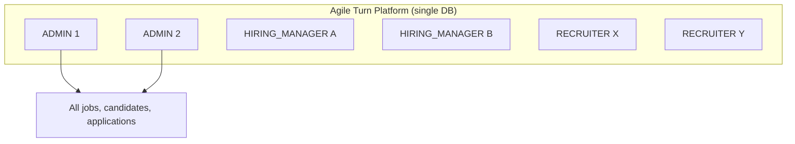

Today, HM and Recruiter do **not** have isolated silos. They share data when linked to the same job through `JobAssignment`.

### 3.3 Current access control flow

```mermaid
flowchart LR
  REQ[API Request] --> AUTH[requireApiAuth]
  AUTH --> ROLE{role?}
  ROLE -->|ADMIN| NOFILTER[where: {}]
  ROLE -->|HM / RECRUITER| ASSIGN[where: assignments.some userId]
  NOFILTER --> DB[(PostgreSQL)]
  ASSIGN --> DB
```

Core scope helpers in `src/lib/rbac-scope.ts`:

| Helper | ADMIN | HM / RECRUITER |
|--------|-------|----------------|
| `buildJobVisibilityWhere` | `{}` | `{ assignments: { some: { userId } } }` |
| `buildApplicationVisibilityWhere` | `{}` | job has assignment for user |
| `buildCandidateVisibilityWhere` | `{}` | candidate has application on assigned job |
| `canAccessJobByScope` | `true` | `JobAssignment` row exists for `(jobId, userId)` |

Example — jobs list (`GET /api/jobs`):

```40:43:app/api/jobs/route.ts
  const where: Parameters<typeof prisma.job.findMany>[0]["where"] = buildJobVisibilityWhere(
    role,
    userId
  );
```

### 3.4 Current data sharing via JobAssignment

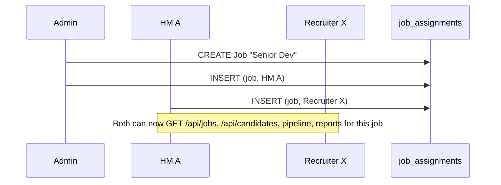

**Assignment creation paths:**

| Path | Who | Code |
|------|-----|------|
| Job create with `hiringManagerIds` | ADMIN | `src/lib/job-create-from-body.ts` → `jobAssignment.createMany` |
| Manual assign | ADMIN → HM only | `POST /api/jobs/[id]/assignments` |
| Manual assign | HM → RECRUITER only | same route |
| Remove assign | ADMIN / HM | `DELETE /api/jobs/[id]/assignments/[userId]` |

Assignment rules in `app/api/jobs/[id]/assignments/route.ts`:

- ADMIN can assign **HIRING_MANAGER** only
- HIRING_MANAGER can assign **RECRUITER** only (on jobs they can already access)

### 3.5 Current entity model (relevant fields)

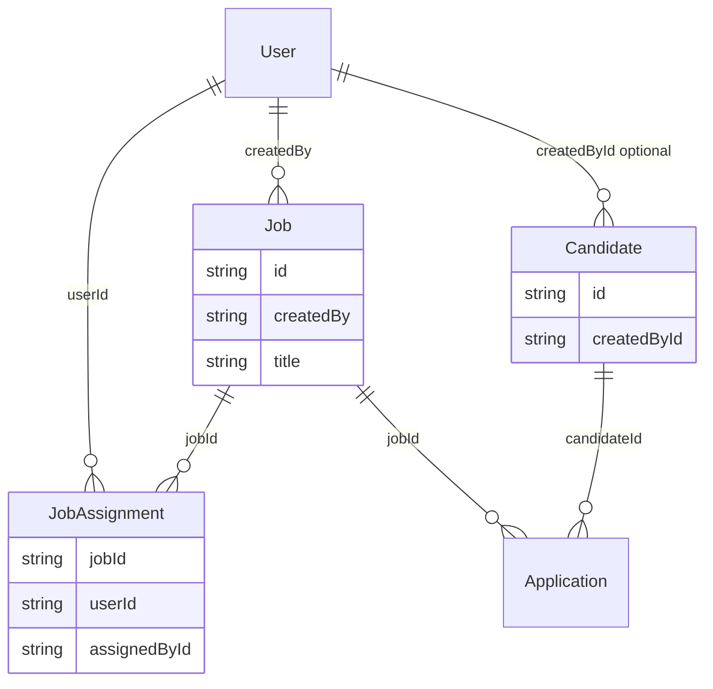

**Key observation:** `Job.createdBy` and `Candidate.createdById` exist for audit but are **not** used for list/get scoping. Scoping uses `JobAssignment` only.

### 3.6 Known leaks in current model

| Issue | Location | Effect |
|-------|----------|--------|
| Assignment = shared access | `src/lib/rbac-scope.ts` | Recruiter X sees HM A’s job after assignment |
| Zero-application candidates | `canAccessCandidateForRecommendations` in `rbac-scope.ts` | Any HM/recruiter with **any** job assignment can see candidates with no applications |
| CRM scoped by assignment | `src/lib/crm/crm-scope.ts` | CRM clients visible via assigned jobs, not user ownership |
| Reports scoped by assignment | `src/lib/reports-job-filter.ts` | Same sharing semantics as jobs |

---

## 4. Target architecture (to-be)

### 4.1 Isolation principle

> **Every owned record has exactly one `ownerId` (FK → `User.id`).**  
> **ADMIN bypasses the filter. HM and RECRUITER are filtered to `ownerId = session.user.id`.**

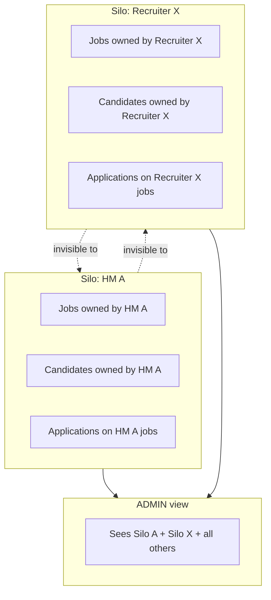

### 4.2 Target access control flow

```mermaid
flowchart LR
  REQ[API Request] --> AUTH[requireApiAuth]
  AUTH --> ROLE{role?}
  ROLE -->|ADMIN| NOFILTER[where: {}]
  ROLE -->|HM / RECRUITER| OWNER[where: ownerId = userId]
  NOFILTER --> DB[(PostgreSQL)]
  OWNER --> DB
```

### 4.3 Target scope helpers (proposed)

Replace assignment filters in `src/lib/rbac-scope.ts`:

```typescript
/** Proposed — not yet in codebase */
export function buildJobVisibilityWhere(
  role: string | undefined,
  userId: string | undefined
): Prisma.JobWhereInput {
  if (isAdmin(role)) return {};
  if (!userId) return { id: "__no_access__" };
  return { ownerId: userId };
}

export function buildCandidateVisibilityWhere(
  role: string | undefined,
  userId: string | undefined
): Prisma.CandidateWhereInput {
  if (isAdmin(role)) return {};
  if (!userId) return { id: "__no_access__" };
  return { ownerId: userId };
}

export function buildApplicationVisibilityWhere(
  role: string | undefined,
  userId: string | undefined
): Prisma.ApplicationWhereInput {
  if (isAdmin(role)) return {};
  if (!userId) return { id: "__no_access__" };
  return { job: { ownerId: userId } };
}

export async function canAccessJobByScope(
  role: string | undefined,
  userId: string | undefined,
  jobId: string
): Promise<boolean> {
  if (isAdmin(role)) return true;
  if (!userId) return false;
  const job = await prisma.job.findFirst({
    where: { id: jobId, ownerId: userId },
    select: { id: true },
  });
  return job != null;
}
```

### 4.4 Admin multi-admin behavior

No schema change needed. Multiple users with `role = ADMIN` already receive empty scope filters via `isAdmin()` in `src/lib/rbac.ts` and `src/lib/rbac-scope.ts`.

Optional admin UX (future):

- Filter dashboard/reports by `ownerId` or role
- “View as user” read-only impersonation (audit-heavy; out of scope unless requested)

### 4.5 Target entity model

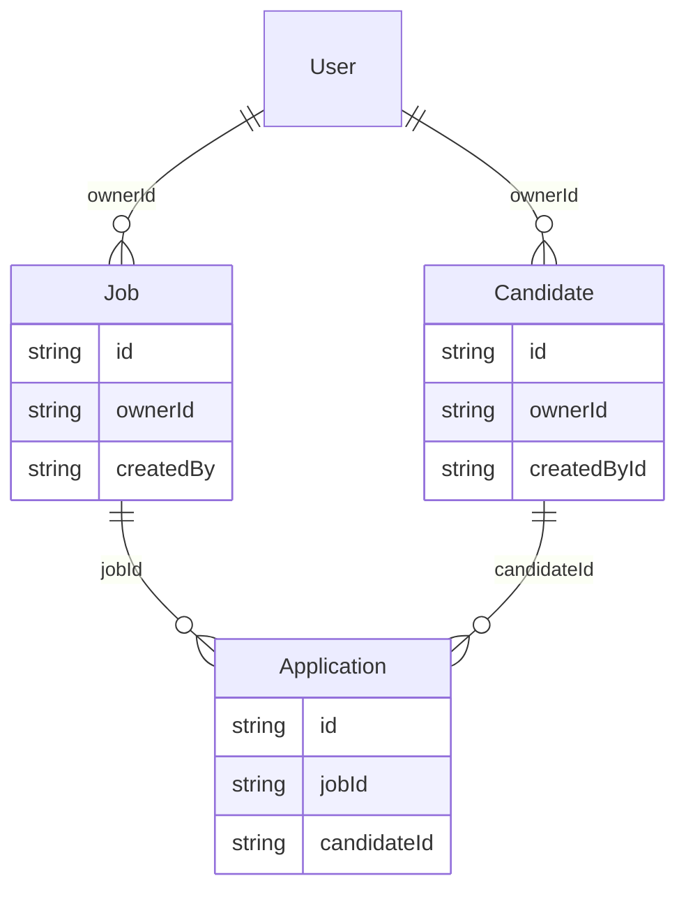

**Ownership rules:**

| Entity | `ownerId` set on create | Visibility inherited |
|--------|-------------------------|-------------------|
| `Job` | `session.user.id` | — |
| `Candidate` | `session.user.id` | — |
| `Application` | — | Via `job.ownerId` (candidate must also belong to same owner — enforce on create) |
| `Interview`, `Note`, etc. | — | Via parent application/job/candidate owner |

**Cross-owner application guard (required on create):**

```
application.job.ownerId === application.candidate.ownerId === session.user.id
```

(or ADMIN can attach any owned job to any owned candidate they can see — typically same owner only)

---

## 5. Gap analysis

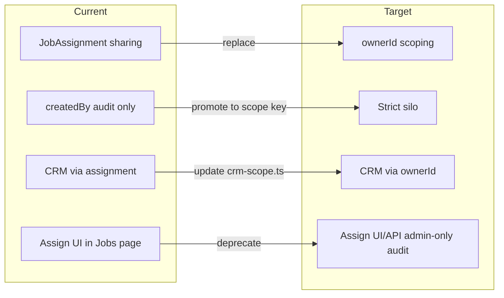

| Area | Current | Target | Effort |
|------|---------|--------|--------|
| Schema | No `ownerId` | Add `ownerId` + indexes | Medium |
| `rbac-scope.ts` | Assignment filters | Owner filters | Medium |
| Job create | ADMIN only (`canCreateJob`) | HM + RECRUITER create own jobs; `ownerId = self` | Low |
| Assignments API/UI | Active sharing mechanism | **Admin-only audit** — no scope impact | Medium |
| Candidates w/ 0 apps | Visible to any assigned user | Visible only if `ownerId = userId` | Low |
| Notifications | Notifies assigned users | Notify job `ownerId` only | Low |
| CRM scope | `crm-scope.ts` via assignment | **ADMIN only** — block HM/recruiter on CRM routes + pages | Low |
| Reports/dashboard | Assignment-based | Owner-based | Medium |
| Public apply page | `app/apply/[jobId]/page.tsx` uses scope check | Must still work for OPEN jobs (owner-agnostic read for applicants) | Review |

---

## 6. Data model design

### 6.1 Schema changes (proposed)

```prisma
model Job {
  id        String @id @default(cuid())
  ownerId   String @map("owner_id")
  owner     User   @relation("JobOwner", fields: [ownerId], references: [id], onDelete: Restrict)
  createdBy String @map("created_by")
  // ... existing fields ...

  @@index([ownerId])
}

model Candidate {
  id      String @id @default(cuid())
  ownerId String @map("owner_id")
  owner   User   @relation("CandidateOwner", fields: [ownerId], references: [id], onDelete: Restrict)
  // ... existing fields ...

  @@index([ownerId])
}
```

Add to `User` model:

```prisma
ownedJobs       Job[]       @relation("JobOwner")
ownedCandidates Candidate[] @relation("CandidateOwner")
```

### 6.2 Candidate email — duplicates allowed (R7)

`Candidate.email` is **not** globally unique in `prisma/schema.prisma` (only `User.email` and `EmailPreference.email` are `@unique`). Two owners may each have a candidate with `jane@example.com` — separate rows, separate silos.

**Implementation notes:**

| Area | Change |
|------|--------|
| Create candidate | Do **not** reject duplicate email if another owner already has that address |
| List/get candidates | Always filter by `ownerId` first — duplicates never visible cross-silo |
| `src/lib/candidate-identity.ts` | Today dedupes by email **globally** for applicant counts — scope dedupe to **same owner** (or admin-only global dedupe) |
| `EmailPreference` | Global `@unique` on `email` — two candidate rows with same email may share one preference row; document or key by `(ownerId, email)` if needed later |
| Public apply | Reuse candidate by email **within job owner’s silo** only |

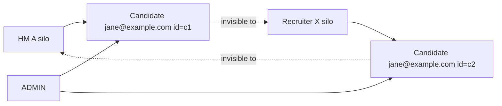

### 6.3 CRM — admin only (R8)

HM and RECRUITER **must not** access CRM data or routes.

| Layer | Enforcement |
|-------|-------------|
| API | `requireApiAuth(isAdmin)` on all `/api/crm/*` routes |
| Pages | `requireAuth(["ADMIN"])` on CRM dashboard segments |
| Scope | Remove or bypass `src/lib/crm/crm-scope.ts` for non-admin — HM/recruiter never reach CRM queries |
| ATS ↔ CRM link | `CrmRequirement.jobId` remains admin-managed; job `ownerId` is independent |

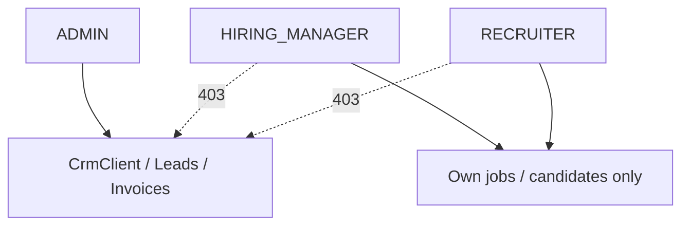

No `ownerId` on CRM entities required for HM/recruiter isolation — access is role-gated to ADMIN only.

### 6.4 JobAssignment — audit-only (R9)

**Confirmed:** Keep `JobAssignment` table and admin-facing UI/API. Rows are **metadata only**.

| Rule | Detail |
|------|--------|
| Who can write | **ADMIN only** — create/delete assignment rows |
| Who can read | **ADMIN only** — audit/history view on job detail |
| Scope impact | **None** — remove all reads of `JobAssignment` from `rbac-scope.ts`, reports, dashboard, notifications |
| HM/recruiter assign UI | **Remove** from `components/pages/Jobs.tsx` for non-admin |
| `hiringManagerIds` on job create | **Remove** from create flow (or admin audit POST after create) |

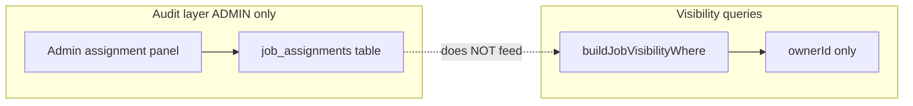

### 6.5 Entity ownership diagram (full)

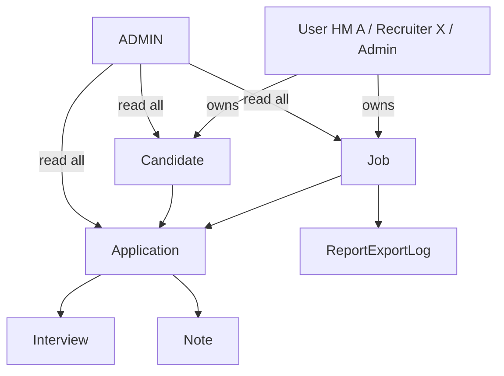

---

## 7. RBAC & scope helpers

### 7.1 Layered checks (unchanged pattern)

Every protected route continues to use:

1. **Authentication** — `requireApiAuth()` (`src/lib/api-auth.ts`)
2. **Action permission** — `canCreateJob`, `canEditCandidate`, etc. (`src/lib/rbac.ts`)
3. **Object scope** — `build*VisibilityWhere` / `canAccessJobByScope` (`src/lib/rbac-scope.ts`) ← **this layer changes**

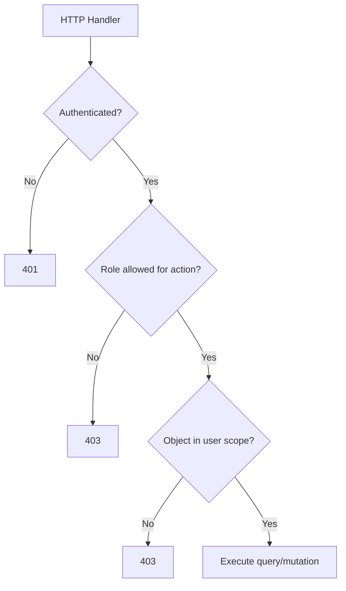

### 7.2 Role × action matrix (unchanged from `src/lib/rbac.ts`)

| Action | ADMIN | HIRING_MANAGER | RECRUITER |
|--------|-------|----------------|-----------|
| Delete job | Yes | No | No |
| Create job | Yes | Yes — `ownerId = self` | Yes — `ownerId = self` |
| Update job | Yes | Own jobs only (`ownerId`) | Own jobs only (`ownerId`) |
| Create candidate | Yes | Own scope | Own scope |
| CRM (leads, clients, invoices) | Yes | **No** | **No** |
| View all users’ data | Yes | No | No |
| Record job assignment (audit) | Yes | No | No |
| Invite users | Yes | No | No |

**Code change required in `src/lib/rbac.ts`:**

```typescript
/** Today: return isAdmin(role); Target: */
export function canCreateJob(role: string | undefined): boolean {
  return isAdmin(role) || isHiringManager(role) || isRecruiter(role);
}
```

POST `/api/jobs` must set `ownerId = session.user.id` for HM/recruiter (admin may set `ownerId` explicitly when creating on behalf of someone — optional future).

### 7.3 Create-path ownership

On every **create** mutation, set:

```typescript
ownerId: session.user.id
```

Files that create jobs/candidates (non-exhaustive):

- `src/lib/job-create-from-body.ts`
- `app/api/candidates/route.ts`
- `app/api/applications/route.ts` (validate job + candidate same owner)

---

## 8. JobAssignment — current behavior & audit-only migration

### 8.1 What assignment does today (reference)

| Step | Behavior |
|------|----------|
| 1 | Row inserted in `job_assignments` |
| 2 | User appears in `GET /api/jobs` for that job |
| 3 | User sees applications/candidates on that job |
| 4 | User included in report/dashboard scope |
| 5 | User may receive job-scoped notifications |

### 8.2 Assignment vs strict silo

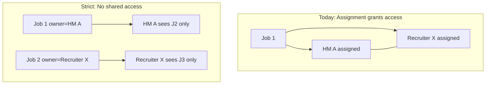

### 8.3 Audit-only migration checklist (R9)

| Item | Action |
|------|--------|
| `src/lib/rbac-scope.ts` | **Remove** all `assignments` / `JobAssignment` reads from scope |
| `src/lib/reports-job-filter.ts` | Scope by `job.ownerId` only |
| `src/lib/dashboard-sidebar-nav.ts` | Count by `job.ownerId` only |
| `src/lib/notification-service.ts` | Notify `job.ownerId` (+ creator if different); **not** assignees |
| `src/lib/crm/crm-scope.ts` | Admin-only CRM; remove assignment-based CRM visibility |
| `app/api/jobs/[id]/assignments/route.ts` | **ADMIN only** — audit CRUD; document “no access impact” |
| `app/api/jobs/[id]/assignments/[userId]/route.ts` | **ADMIN only** delete |
| `components/pages/Jobs.tsx` assignment dialog | **Admin only** — label “Audit assignment (no access granted)” |
| `hooks/queries/useJobs.ts` / `lib/api/jobs.ts` | Keep for admin audit panel |
| `src/lib/job-create-from-body.ts` `hiringManagerIds` | Remove auto-assign on create; admin uses audit API separately if needed |
| `prisma/schema.prisma` `JobAssignment` | **Keep table** — no drop |
| `src/lib/resolve-job-interviewers.ts` | Use job owner + explicit interview interviewers — not assignees |

---

## 9. API & file migration inventory

Files that reference assignment-based scope or `canAccessJobByScope` (must be updated or verified):

### 9.1 Core libraries

| File | Change |
|------|--------|
| `src/lib/rbac-scope.ts` | Replace assignment filters with `ownerId` |
| `src/lib/reports-job-filter.ts` | Scope by `job.ownerId` |
| `src/lib/crm/crm-scope.ts` | ADMIN-only gate; remove HM/recruiter paths |
| `src/lib/rbac.ts` | `canCreateJob` → ADMIN + HM + RECRUITER |
| `src/lib/dashboard-sidebar-nav.ts` | Count jobs by owner |
| `src/lib/notification-service.ts` | Notify owner, not assignees |
| `src/lib/batch-applications.ts` | Owner scope on job lookup |
| `src/lib/ai/recruiter-search.ts` | Search only owned candidates |
| `src/lib/job-create-from-body.ts` | Set `ownerId`, remove HM assign |

### 9.2 API routes (representative groups)

**Jobs**

- `app/api/jobs/route.ts`
- `app/api/jobs/[id]/route.ts`
- `app/api/jobs/[id]/status/route.ts`
- `app/api/jobs/[id]/applications/route.ts`
- `app/api/jobs/[id]/assignments/*` — **ADMIN-only audit** (no scope coupling)
- `/api/crm/*` — **ADMIN only**

**Candidates**

- `app/api/candidates/route.ts`
- `app/api/candidates/[id]/route.ts`
- `app/api/candidates/[id]/applications/route.ts`
- `app/api/candidates/[id]/resume/route.ts`
- `app/api/candidates/[id]/recommendations/*`

**Applications & pipeline**

- `app/api/applications/route.ts`
- `app/api/applications/[id]/route.ts`
- `app/api/applications/[id]/stage/route.ts`
- `app/api/pipeline/route.ts`
- `app/api/pipeline/stats/route.ts`

**Interviews**

- `app/api/interviews/route.ts`
- `app/api/interviews/[id]/*`

**Reports & dashboard**

- `app/api/dashboard/summary/route.ts`
- `app/api/dashboard/charts/route.ts`
- `app/api/dashboard/activity/route.ts`
- `app/api/reports/overview/route.ts`
- `app/api/reports/pipeline/route.ts`
- `app/api/reports/time-to-hire/route.ts`
- `app/api/reports/source/route.ts`
- `app/api/reports/export/route.ts`

**Public**

- `app/apply/[jobId]/page.tsx` — applicants must submit without login; job read may bypass owner scope for OPEN jobs

### 9.3 Frontend

| File | Change |
|------|--------|
| `components/pages/Jobs.tsx` | Assignment modal **admin-only** with audit disclaimer; enable job create for HM/recruiter |
| CRM pages | `requireAuth(["ADMIN"])` |
| Admin dashboards | Filter by `ownerId` / role |

---

## 10. Migration & backfill plan

### 10.1 Phase diagram

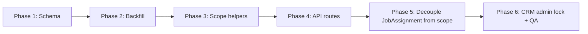

### 10.2 Phase 1 — Schema

1. Add nullable `owner_id` to `jobs` and `candidates`
2. Deploy migration (non-breaking while nullable)

### 10.3 Phase 2 — Backfill

| Table | Backfill rule |
|-------|---------------|
| `jobs` | `owner_id = created_by` |
| `candidates` | `owner_id = created_by_id` where not null; else first application’s job owner; else assign to first ADMIN |
| CRM | No owner backfill — ADMIN-only module unchanged |

Then set `owner_id NOT NULL` on `jobs` and `candidates`.

### 10.4 Phase 3 — Scope helpers

Switch `rbac-scope.ts` and `reports-job-filter.ts` to owner-based filters. CRM routes: admin-only.

### 10.5 Phase 4 — API creates & RBAC

1. Update `canCreateJob` in `src/lib/rbac.ts` for HM + RECRUITER
2. POST `/api/jobs` sets `ownerId = session.user.id`
3. POST `/api/candidates` sets `ownerId = session.user.id`; allow duplicate email across owners
4. Application create: validate `job.ownerId === candidate.ownerId === session.user.id`

### 10.6 Phase 5 — Decouple JobAssignment (audit-only)

1. Remove `JobAssignment` from all visibility/notification/report queries
2. Restrict assignment API + UI to **ADMIN only**
3. **Keep** `job_assignments` table for audit history
4. Update `src/lib/candidate-identity.ts` to owner-scoped dedupe

### 10.7 Phase 6 — CRM admin lock & QA

1. Enforce `isAdmin` on all CRM API routes and pages
2. Run full test checklist ([§11](#11-testing-checklist))

### 10.8 Rollback strategy

Keep migration reversible until Phase 5:

- Scope helpers can temporarily support `OR: [ownerId, assignments]` during cutover (not for production strict silo — staging only)

---

## 11. Testing checklist

### 11.1 Isolation tests

| # | Scenario | Expected |
|---|----------|----------|
| T1 | HM A lists jobs | Only jobs where `ownerId = HM A` |
| T2 | Recruiter X lists jobs | Only jobs where `ownerId = Recruiter X` |
| T3 | HM A GET job owned by Recruiter X | 403 |
| T4 | Recruiter X lists candidates | Only own candidates |
| T5 | HM A creates application on own job + own candidate | 201 |
| T6 | HM A creates application using Recruiter X’s candidate | 403 |
| T7 | Candidate with zero applications, owned by HM A | Visible to HM A only |
| T8 | ADMIN lists jobs | All jobs |
| T9 | ADMIN filters by ownerId | Subset correct |
| T10 | Second ADMIN sees same data as first ADMIN | Yes |
| T11 | HM A creates job | 201; `ownerId = HM A`; visible in HM A list only |
| T12 | Recruiter X creates job | 201; `ownerId = Recruiter X` |
| T13 | HM A + Recruiter X both add `jane@example.com` | Two candidate rows; each owner sees only their row |
| T14 | Admin records JobAssignment (HM A, job owned by Recruiter X) | Row saved; Recruiter X still sole viewer; HM A still 403 on job |
| T15 | HM A GET `/api/crm/clients` | 403 |
| T16 | ADMIN GET `/api/crm/clients` | 200 |

### 11.2 Regression tests

| # | Scenario | Expected |
|---|----------|----------|
| R1 | Public apply to OPEN job | Still works |
| R2 | Resume upload/download | Scoped to owner |
| R3 | Reports export | Scoped to owner; admin sees all |
| R4 | AI search / recommendations | Only owned candidates |
| R5 | Notifications | Owner receives alerts, not other users |

### 11.3 Test matrix diagram

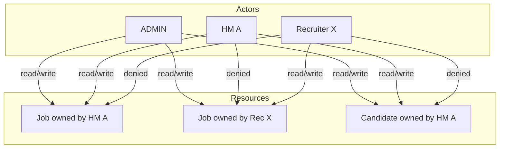

---

## 12. Resolved decisions

All product decisions are locked for implementation:

| # | Question | **Decision** |
|---|----------|--------------|
| O1 | Who can create jobs? | **HM and RECRUITER create their own** — `ownerId = session.user.id`; update `canCreateJob` |
| O2 | Duplicate candidate emails across owners? | **Allowed** — separate `Candidate` rows per owner; scope queries by `ownerId` |
| O3 | CRM module scope | **ADMIN only** — HM/recruiter blocked from CRM routes and pages |
| O4 | `JobAssignment` | **Keep as audit-only** — admin records assignments; **zero impact** on visibility |
| O5 | `createdBy` vs `ownerId` | **Keep both** — `createdBy`/`createdById` for audit trail; `ownerId` for scope (default same on create) |

### Remaining implementation detail (not product decisions)

| Item | Default for v1 |
|------|----------------|
| Admin creates job on behalf of another user | Optional `ownerId` body field on POST `/api/jobs` (admin only); else `ownerId = admin id` |
| Admin reassign job/candidate owner | Out of scope v1 — add PATCH admin endpoint later if needed |
| `EmailPreference` shared across duplicate candidate emails | Accept v1 quirk; revisit with composite key if opt-out bugs appear |

---

## 13. Related docs

| Document | Relevance |
|----------|-----------|
| [docs/API_RBAC.md](./API_RBAC.md) | Server-side auth pattern (`requireApiAuth`) — still applies |
| [docs/ROUTE_PROTECTION.md](./ROUTE_PROTECTION.md) | Page-level auth — unchanged |
| [prisma/MIGRATION_GUIDE.md](../prisma/MIGRATION_GUIDE.md) | Prisma migration workflow |
| `src/lib/rbac.ts` | Action-level permissions |
| `src/lib/rbac-scope.ts` | **Primary file to change** for object scope |

---

## Appendix A — Side-by-side comparison

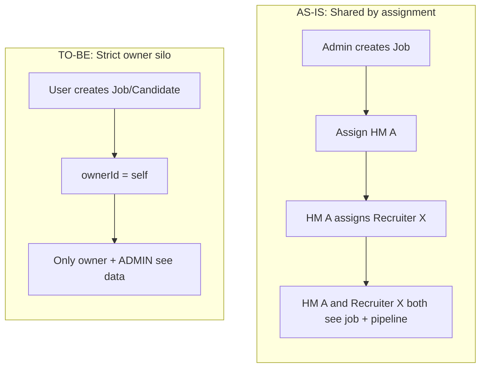

| Dimension | As-is | To-be |
|-----------|-------|-------|
| Isolation key | `JobAssignment.userId` | `Job.ownerId`, `Candidate.ownerId` |
| HM ↔ Recruiter | Can share via assignment | Never share |
| Admin | Full visibility | Full visibility (unchanged) |
| Candidate pool | Shared on same job | Per-user pool |
| CRM | Via assigned jobs | **ADMIN only** |
| Job creation | ADMIN only | **ADMIN + HM + RECRUITER** (own jobs) |
| Candidate email | Implicit global dedupe in places | **Per-owner duplicates allowed** |
| JobAssignment | Grants access | **Audit-only (ADMIN)** |
| Complexity | Assignment = sharing | Owner silo + admin audit trail |

---

## Appendix B — Glossary

| Term | Meaning in this doc |
|------|-------------------|
| **Strict silo** | User sees only records they own |
| **Owner** | User whose `id` is stored in `ownerId` |
| **Assignment (audit)** | `JobAssignment` row — ADMIN-only metadata; does **not** grant access |
| **Scope** | Object-level filter applied after role check |
| **ADMIN** | Platform super-user at Agile Turn; multiple admins allowed |
